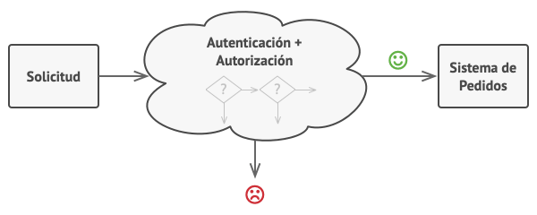
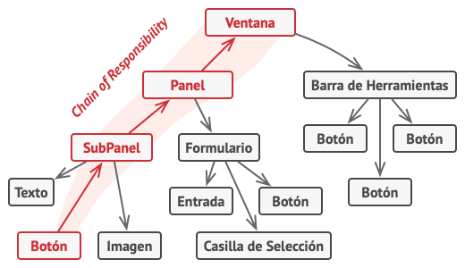
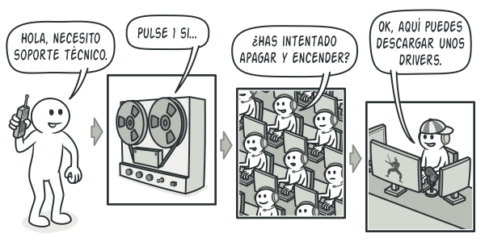
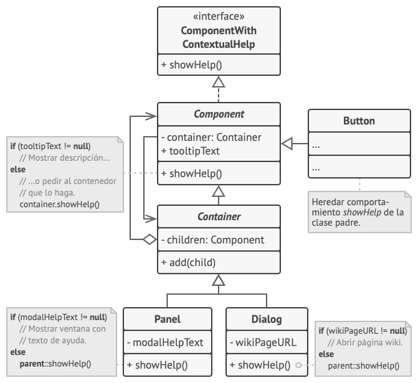

# Chain of Responsibility

> [!NOTE]
> Cadena de responsabilidad, CoR, Chain of Command

## Proposito

Chain of Responsibility es un patrón de diseño de comportamiento que te permite pasar solicitudes a lo largo de una cadena de manejadores. Al recibir una solicitud, cada manejador decide si la procesa o si la pasa al siguiente manejador de la cadena.

## Problema

Imagina que estás trabajando en un sistema de pedidos online. Quieres restringir el acceso al sistema de forma que únicamente los usuarios autenticados puedan generar pedidos. Además, los usuarios que tengan permisos administrativos deben tener pleno acceso a todos los pedidos.

Tras planificar un poco, te das cuenta de que estas comprobaciones deben realizarse secuencialmente. La aplicación puede intentar autenticar a un usuario en el sistema cuando reciba una solicitud que contenga las credenciales del usuario. Sin embargo, si esas credenciales no son correctas y la autenticación falla, no hay razón para proceder con otras comprobaciones.

Durante los meses siguientes, implementas varias de esas comprobaciones secuenciales.

- Uno de tus colegas sugiere que no es seguro pasar datos sin procesar directamente al sistema de pedidos. De modo que añades un paso adicional de validación para sanear los datos de una solicitud.

- Más tarde, alguien se da cuenta de que el sistema es vulnerable al desciframiento de contraseñas por la fuerza. Para evitarlo, añades rápidamente una comprobación que filtra las solicitudes fallidas repetidas que vengan de la misma dirección IP.

- Otra persona sugiere que podrías acelerar el sistema devolviendo los resultados en caché en solicitudes repetidas que contengan los mismos datos, de modo que añades otra comprobación que permite a la solicitud pasar por el sistema únicamente cuando no hay una respuesta adecuada en caché.

## Solucion

El código de las comprobaciones, que ya se veía desordenado, se vuelve más y más abotargado cada vez que añades una nueva función. En ocasiones, un cambio en una comprobación afecta a las demás. Y lo peor de todo es que, cuando intentas reutilizar las comprobaciones para proteger otros componentes del sistema, tienes que duplicar parte del código, ya que esos componentes necesitan parte de las comprobaciones, pero no todas ellas.

El sistema se vuelve muy difícil de comprender y costoso de mantener. Luchas con el código durante un tiempo hasta que un día decides *refactorizarlo todo*.

Al igual que muchos otros patrones de diseño de comportamiento, el Chain of Responsibility se basa en transformar comportamientos particulares en objetos autónomos llamados manejadores. En nuestro caso, cada comprobación debe ponerse dentro de su propia clase con un único método que realice la comprobación. La solicitud, junto con su información, se pasa a este método como argumento.

El patrón sugiere que vincules esos manejadores en una cadena. Cada manejador vinculado tiene un campo para almacenar una referencia al siguiente manejador de la cadena. Además de procesar una solicitud, los manejadores la pasan a lo largo de la cadena. La solicitud viaja por la cadena hasta que todos los manejadores han tenido la oportunidad de procesarla.

Y ésta es la mejor parte: un manejador puede decidir no pasar la solicitud más allá por la cadena y detener con ello el procesamiento.

En nuestro ejemplo de los sistemas de pedidos, un manejador realiza el procesamiento y después decide si pasa la solicitud al siguiente eslabón de la cadena. Asumiendo que la solicitud contiene la información correcta, todos los manejadores pueden ejecutar su comportamiento principal, ya sean comprobaciones de autenticación o almacenamiento en la memoria caché.

No obstante, hay una solución ligeramente diferente (y un poco más estandarizada) en la que, al recibir una solicitud, un manejador decide si puede procesarla. Si puede, no pasa la solicitud más allá. De modo que un único manejador procesa la solicitud o no lo hace ninguno en absoluto. Esta solución es muy habitual cuando tratamos con eventos en pilas de elementos dentro de una interfaz gráfica de usuario (GUI).

Por ejemplo, cuando un usuario hace clic en un botón, el evento se propaga por la cadena de elementos GUI que comienza en el botón, recorre sus contenedores (como formularios o paneles) y acaba en la ventana principal de la aplicación. El evento es procesado por el primer elemento de la cadena que es capaz de gestionarlo. Este ejemplo también es destacable porque muestra que siempre se puede extraer una cadena de un árbol de objetos.

Es fundamental que todas las clases manejadoras implementen la misma interfaz. Cada manejadora concreta solo debe preocuparse por la siguiente que cuente con el método ``ejecutar``. De esta forma puedes componer cadenas durante el tiempo de ejecución, utilizando varios manejadores sin acoplar tu código a sus clases concretas.

### Analogia Real

Acabas de comprar e instalar una nueva pieza de hardware en tu computadora. Como eres un fanático de la informática, la computadora tiene varios sistemas operativos instalados. Intentas arrancarlos todos para ver si soportan el hardware. Windows detecta y habilita el hardware automáticamente. Sin embargo, tu querido Linux se niega a funcionar con el nuevo hardware. Ligeramente esperanzado, decides llamar al número de teléfono de soporte técnico escrito en la caja.

Lo primero que oyes es la voz robótica del contestador automático. Te sugiere nueve soluciones populares a varios problemas, pero ninguna de ellas es relevante a tu caso. Después de un rato, el robot te conecta con un operador humano.

Por desgracia, el operador tampoco consigue sugerirte nada específico. Se dedica a recitar largos pasajes del manual, negándose a escuchar tus comentarios. Cuando escuchas por enésima vez la frase “¿has intentado apagar y encender la computadora?”, exiges que te pasen con un ingeniero de verdad.

Por fin, el operador pasa tu llamada a unos de los ingenieros, que probablemente ansiaba una conversación humana desde hacía tiempo, sentado en la solitaria sala del servidor del oscuro sótano de un edificio de oficinas. El ingeniero te indica dónde descargar los drivers adecuados para tu nuevo hardware y cómo instalarlos en Linux. Por fin, ¡la solución! Acabas la llamada dando saltos de alegría.

## Estructura

1. La clase **Manejadora** declara la interfaz común a todos los manejadores concretos. Normalmente contiene un único método para manejar solicitudes, pero en ocasiones también puede contar con otro método para establecer el siguiente manejador de la cadena.

2. La clase **Manejadora** Base es opcional y es donde puedes colocar el código boilerplate (segmentos de código que suelen no alterarse) común para todas las clases manejadoras.

> [!NOTE]
> Normalmente, esta clase define un campo para almacenar una referencia al siguiente manejador. Los clientes pueden crear una cadena pasando un manejador al constructor o modificador (setter) del manejador previo. La clase también puede implementar el comportamiento de gestión por defecto: puede pasar la ejecución al siguiente manejador después de comprobar su existencia.

3. Los **Manejadores Concretos** contienen el código para procesar las solicitudes. Al recibir una solicitud, cada manejador debe decidir si procesarla y, además, si la pasa a lo largo de la cadena.

> [!NOTE]
> Habitualmente los manejadores son autónomos e inmutables, y aceptan toda la información necesaria únicamente a través del constructor.

4. El **Cliente** puede componer cadenas una sola vez o componerlas dinámicamente, dependiendo de la lógica de la aplicación. Observa que se puede enviar una solicitud a cualquier manejador de la cadena; no tiene por qué ser al primero.

## Implementacion

En este ejemplo, el patrón Chain of Responsibility es responsable de mostrar información de ayuda contextual para elementos GUI activos.

## Aplicabilidad

- Utiliza el patrón Chain of Responsibility cuando tu programa deba procesar distintos tipos de solicitudes de varias maneras, pero los tipos exactos de solicitudes y sus secuencias no se conozcan de antemano.

- Utiliza el patrón cuando sea fundamental ejecutar varios manejadores en un orden específico.

- Utiliza el patrón Chain of Responsibility cuando el grupo de manejadores y su orden deban cambiar durante el tiempo de ejecución.

## Como Usarlo

1. Declara la interfaz manejadora y describe la firma de un método para manejar solicitudes. Decide cómo pasará el cliente la información de la solicitud dentro del método. La forma más flexible consiste en convertir la solicitud en un objeto y pasarlo al método de gestión como argumento.

2. Para eliminar código boilerplate duplicado en manejadores concretos, puede merecer la pena crear una clase manejadora abstracta base, derivada de la interfaz manejadora. Esta clase debe tener un campo para almacenar una referencia al siguiente manejador de la cadena. Considera hacer la clase inmutable. No obstante, si planeas modificar las cadenas durante el tiempo de ejecución, deberás definir un modificador (setter) para alterar el valor del campo de referencia. También puedes implementar el comportamiento por defecto conveniente para el método de control, que consiste en reenviar la solicitud al siguiente objeto, a no ser que no quede ninguno. Los manejadores concretos podrán utilizar este comportamiento invocando al método padre.

3. Una a una, crea subclases manejadoras concretas e implementa los métodos de control. Cada manejador debe tomar dos decisiones cuando recibe una solicitud:
- Si procesa la solicitud.
- Si pasa la solicitud al siguiente eslabón de la cadena.

4. El cliente puede ensamblar cadenas por su cuenta o recibir cadenas prefabricadas de otros objetos. En el último caso, debes implementar algunas clases fábrica para crear cadenas de acuerdo con los ajustes de configuración o de entorno.

5. El cliente puede activar cualquier manejador de la cadena, no solo el primero. La solicitud se pasará a lo largo de la cadena hasta que algún manejador se rehúse a pasarlo o hasta que llegue al final de la cadena.

6. Debido a la naturaleza dinámica de la cadena, el cliente debe estar listo para gestionar los siguientes escenarios:
- La cadena puede consistir en un único vínculo.
- Algunas solicitudes pueden no llegar al final de la cadena.
- Otras pueden llegar hasta el final de la cadena sin ser gestionadas.

## Pros y contras

Pros  | Contras
------------- | -------------
Puedes controlar el orden de control de solicitudes.  |  Algunas solicitudes pueden acabar sin ser gestionadas.
Principio de responsabilidad única. Puedes desacoplar las clases que invoquen operaciones de las que realicen operaciones.  |  
Principio de abierto/cerrado. Puedes introducir nuevos manejadores en la aplicación sin descomponer el código cliente existente.  |  