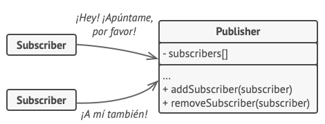
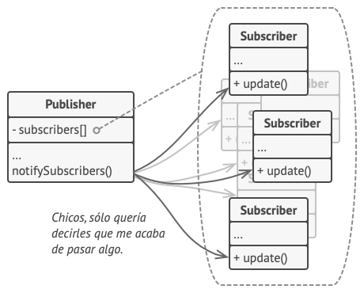
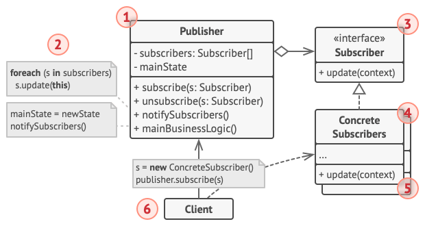

# Observer

> [!NOTE]
> Observador, Publicación-Suscripción, Modelo-patrón, Event-Subscriber, Listener

## Proposito

Observer es un patrón de diseño de comportamiento que te permite definir un mecanismo de suscripción para notificar a varios objetos sobre cualquier evento que le suceda al objeto que están observando

## Problema

Imagina que tienes dos tipos de objetos: un objeto ``Cliente`` y un objeto ``Tienda``. El cliente está muy interesado en una marca particular de producto (digamos, un nuevo modelo de iPhone) que estará disponible en la tienda muy pronto.

El cliente puede visitar la tienda cada día para comprobar la disponibilidad del producto. Pero, mientras el producto está en camino, la mayoría de estos viajes serán en vano.

Por otro lado, la tienda podría enviar cientos de correos (lo cual se podría considerar spam) a todos los clientes cada vez que hay un nuevo producto disponible. Esto ahorraría a los clientes los interminables viajes a la tienda, pero, al mismo tiempo, molestaría a otros clientes que no están interesados en los nuevos productos.

Parece que nos encontramos ante un conflicto. O el cliente pierde tiempo comprobando la disponibilidad del producto, o bien la tienda desperdicia recursos notificando a los clientes equivocados.

## Solucion

El objeto que tiene un estado interesante suele denominarse sujeto, pero, como también va a notificar a otros objetos los cambios en su estado, le llamaremos *notificador* (en ocasiones también llamado publicador). El resto de los objetos que quieren conocer los cambios en el estado del notificador, se denominan *suscriptores*.

El patrón Observer sugiere que añadas un mecanismo de suscripción a la clase notificadora para que los objetos individuales puedan suscribirse o cancelar su suscripción a un flujo de eventos que proviene de esa notificadora. ¡No temas! No es tan complicado como parece. En realidad, este mecanismo consiste en: 1) un campo matriz para almacenar una lista de referencias a objetos suscriptores y 2) varios métodos públicos que permiten añadir suscriptores y eliminarlos de esa lista.

Ahora, cuando le sucede un evento importante al notificador, recorre sus suscriptores y llama al método de notificación específico de sus objetos.

Las aplicaciones reales pueden tener decenas de clases suscriptoras diferentes interesadas en seguir los eventos de la misma clase notificadora. No querrás acoplar la notificadora a todas esas clases. Además, puede que no conozcas algunas de ellas de antemano si se supone que otras personas pueden utilizar tu clase notificadora.

Por eso es fundamental que todos los suscriptores implementen la misma interfaz y que el notificador únicamente se comunique con ellos a través de esa interfaz. Esta interfaz debe declarar el método de notificación junto con un grupo de parámetros que el notificador puede utilizar para pasar cierta información contextual con la notificación.

Si tu aplicación tiene varios tipos diferentes de notificadores y quieres hacer a tus suscriptores compatibles con todos ellos, puedes ir más allá y hacer que todos los notificadores sigan la misma interfaz. Esta interfaz sólo tendrá que describir algunos métodos de suscripción. La interfaz permitirá a los suscriptores observar los estados de los notificadores sin acoplarse a sus clases concretas.

### Analogia

Si te suscribes a un periódico o una revista, ya no necesitarás ir a la tienda a comprobar si el siguiente número está disponible. En lugar de eso, el notificador envía nuevos números directamente a tu buzón justo después de la publicación, o incluso antes.

El notificador mantiene una lista de suscriptores y sabe qué revistas les interesan. Los suscriptores pueden abandonar la lista en cualquier momento si quieren que el notificador deje de enviarles nuevos números.

## Estructura

1. El **Notificador** envía eventos de interés a otros objetos. Esos eventos ocurren cuando el notificador cambia su estado o ejecuta algunos comportamientos. Los notificadores contienen una infraestructura de suscripción que permite a nuevos y antiguos suscriptores abandonar la lista.

2. Cuando sucede un nuevo evento, el notificador recorre la lista de suscripción e invoca el método de notificación declarado en la interfaz suscriptora en cada objeto suscriptor.

3. La interfaz **Suscriptora** declara la interfaz de notificación. En la mayoría de los casos, consiste en un único método ``actualizar``. El método puede tener varios parámetros que permitan al notificador pasar algunos detalles del evento junto a la actualización.

4. Los **Suscriptores Concretos** realizan algunas acciones en respuesta a las notificaciones emitidas por el notificador. Todas estas clases deben implementar la misma interfaz de forma que el notificador no esté acoplado a clases concretas.

5. Normalmente, los suscriptores necesitan cierta información contextual para manejar correctamente la actualización. Por este motivo, a menudo los notificadores pasan cierta información de contexto como argumentos del método de notificación. El notificador puede pasarse a sí mismo como argumento, dejando que los suscriptores extraigan la información necesaria directamente.

6. El **Cliente** crea objetos tipo notificador y suscriptor por separado y después registra a los suscriptores para las actualizaciones del notificador.

## Implementacion

En este ejemplo, el patrón Observer permite al objeto editor de texto notificar a otros objetos tipo servicio sobre los cambios en su estado.

## Aplicabilidad

- Utiliza el patrón Observer cuando los cambios en el estado de un objeto puedan necesitar cambiar otros objetos y el grupo de objetos sea desconocido de antemano o cambie dinámicamente.

- Utiliza el patrón cuando algunos objetos de tu aplicación deban observar a otros, pero sólo durante un tiempo limitado o en casos específicos.

## Como Usarlo

1. Repasa tu lógica de negocio e intenta dividirla en dos partes: la funcionalidad central, independiente del resto de código, actuará como notificador; el resto se convertirá en un grupo de clases suscriptoras.

2. Declara la interfaz suscriptora. Como mínimo, deberá declarar un único método ``actualizar``

3. Declara la interfaz notificadora y describe un par de métodos para añadir y eliminar de la lista un objeto suscriptor. Recuerda que los notificadores deben trabajar con suscriptores únicamente a través de la interfaz suscriptora.

4. Decide dónde colocar la lista de suscripción y la implementación de métodos de suscripción. Normalmente, este código tiene el mismo aspecto para todos los tipos de notificadores, por lo que el lugar obvio para colocarlo es en una clase abstracta derivada directamente de la interfaz notificadora. Los notificadores concretos extienden esa clase, heredando el comportamiento de suscripción.

> [!TIP]
> Sin embargo, si estás aplicando el patrón a una jerarquía de clases existentes, considera una solución basada en la composición: coloca la lógica de la suscripción en un objeto separado y haz que todos los notificadores reales la utilicen.

5. Crea clases notificadoras concretas. Cada vez que suceda algo importante dentro de una notificadora, deberá notificar a todos sus suscriptores.

6. Implementa los métodos de notificación de actualizaciones en clases suscriptoras concretas. La mayoría de las suscriptoras necesitarán cierta información de contexto sobre el evento, que puede pasarse como argumento del método de notificación.

> [!NOTE]
> Pero hay otra opción. Al recibir una notificación, el suscriptor puede extraer la información directamente de ella. En este caso, el notificador debe pasarse a sí mismo a través del método de actualización. La opción menos flexible es vincular un notificador con el suscriptor de forma permanente a través del constructor.

7. El cliente debe crear todos los suscriptores necesarios y registrarlos con los notificadores adecuados.

## Pros y contras

Pros  | Contras
------------- | -------------
Principio de abierto/cerrado. Puedes introducir nuevas clases suscriptoras sin tener que cambiar el código de la notificadora (y viceversa si hay una interfaz notificadora).  |  Los suscriptores son notificados en un orden aleatorio.
Puedes establecer relaciones entre objetos durante el tiempo de ejecución.  |  
