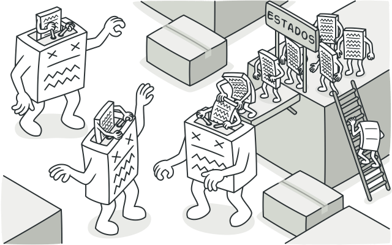
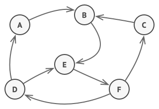
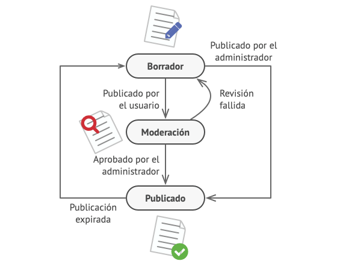
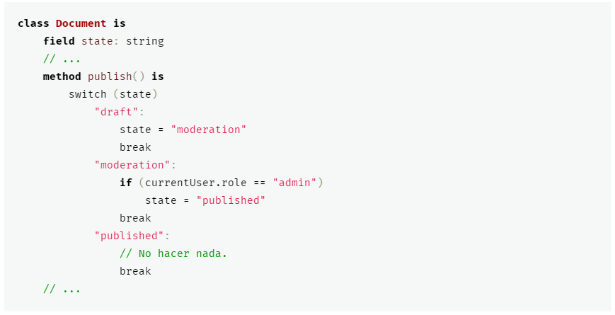
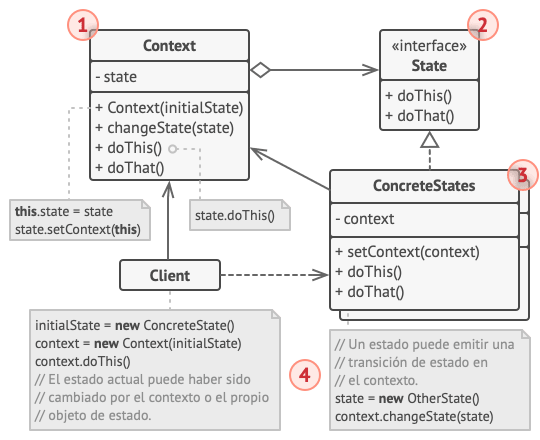
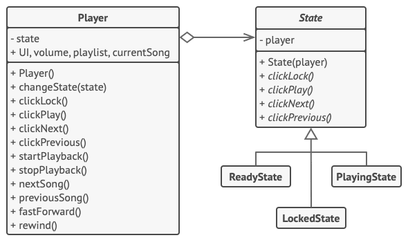

# State

> [!NOTE]
> Estado

## Proposito

State es un patrón de diseño de comportamiento que permite a un objeto alterar su comportamiento cuando su estado interno cambia. Parece como si el objeto cambiara su clase.

## Problema

El patrón State está estrechamente relacionado con el concepto de la *Máquina de estados finitos*

La idea principal es que, en cualquier momento dado, un programa puede encontrarse en un número finito de estados. Dentro de cada estado único, el programa se comporta de forma diferente y puede cambiar de un estado a otro instantáneamente. Sin embargo, dependiendo de un estado actual, el programa puede cambiar o no a otros estados. Estas normas de cambio llamadas *transiciones* también son finitas y predeterminadas.

También puedes aplicar esta solución a los objetos. Imagina que tienes una clase Documento. Un documento puede encontrarse en uno de estos tres estados: ``Borrador``, ``Moderación`` y ``Publicado``. El método publicar del documento funciona de forma ligeramente distinta en cada estado:

- En ``Borrador``, mueve el documento a moderación.
- En ``Moderación``, hace público el documento, pero sólo si el usuario actual es un administrador.
- En ``Publicado``, no hace nada en absoluto.

Las máquinas de estado se implementan normalmente con muchos operadores condicionales (``if`` o ``switch``) que seleccionan el comportamiento adecuado dependiendo del estado actual del objeto. Normalmente, este “estado” es tan solo un grupo de valores de los campos del objeto. Aunque nunca hayas oído hablar de máquinas de estados finitos, probablemente hayas implementado un estado al menos alguna vez. ¿Te suena esta estructura de código?

La mayor debilidad de una máquina de estado basada en condicionales se revela una vez que empezamos a añadir más y más estados y comportamientos dependientes de estados a la clase ``Documento``. La mayoría de los métodos contendrán condicionales monstruosos que eligen el comportamiento adecuado de un método de acuerdo con el estado actual. Un código así es muy difícil de mantener, porque cualquier cambio en la lógica de transición puede requerir cambiar los condicionales de estado de cada método.

El problema tiende a empeorar con la evolución del proyecto. Es bastante difícil predecir todos los estados y transiciones posibles en la etapa de diseño. Por ello, una máquina de estados esbelta, creada con un grupo limitado de condicionales, puede crecer hasta convertirse en un abotargado desastre con el tiempo.

## Solucion

El patrón State sugiere que crees nuevas clases para todos los estados posibles de un objeto y extraigas todos los comportamientos específicos del estado para colocarlos dentro de esas clases.

En lugar de implementar todos los comportamientos por su cuenta, el objeto original, llamado *contexto*, almacena una referencia a uno de los objetos de estado que representa su estado actual y delega todo el trabajo relacionado con el estado a ese objeto.

Para la transición del contexto a otro estado, sustituye el objeto de estado activo por otro objeto que represente ese nuevo estado. Esto sólo es posible si todas las clases de estado siguen la misma interfaz y el propio contexto funciona con esos objetos a través de esa interfaz.

> [!NOTE]
> Esta estructura puede resultar similar al patrón Strategy, pero hay una diferencia clave. En el patrón State, los estados particulares pueden conocerse entre sí e iniciar transiciones de un estado a otro, mientras que las estrategias casi nunca se conocen.

### Analogia

Los botones e interruptores de tu smartphone se comportan de forma diferente dependiendo del estado actual del dispositivo:

- Cuando el teléfono está desbloqueado, al pulsar botones se ejecutan varias funciones.
- Cuando el teléfono está bloqueado, pulsar un botón desbloquea la pantalla.
- Cuando la batería del teléfono está baja, pulsar un botón muestra la pantalla de carga.

## Estructura

1. La clase **Contexto** almacena una referencia a uno de los objetos de estado concreto y le delega todo el trabajo específico del estado. El contexto se comunica con el objeto de estado a través de la interfaz de estado. El contexto expone un modificador (setter) para pasarle un nuevo objeto de estado.

2. La interfaz **Estado** declara los métodos específicos del estado. Estos métodos deben tener sentido para todos los estados concretos, porque no querrás que uno de tus estados tenga métodos inútiles que nunca son invocados.

3. Los **Estados Concretos** proporcionan sus propias implementaciones para los métodos específicos del estado. Para evitar la duplicación de código similar a través de varios estados, puedes incluir clases abstractas intermedias que encapsulen algún comportamiento común.

> [!NOTE]
> Los objetos de estado pueden almacenar una referencia inversa al objeto de contexto. A través de esta referencia, el estado puede extraer cualquier información requerida del objeto de contexto, así como iniciar transiciones de estado.

4. Tanto el estado de contexto como el concreto pueden establecer el nuevo estado del contexto y realizar la transición de estado sustituyendo el objeto de estado vinculado al contexto.

## Implementacion

En este ejemplo, el patrón State permite a los mismos controles del reproductor de medios comportarse de forma diferente, dependiendo del estado actual de reproducción.

## Aplicabilidad

- Utiliza el patrón State cuando tengas un objeto que se comporta de forma diferente dependiendo de su estado actual, el número de estados sea enorme y el código específico del estado cambie con frecuencia.

- Utiliza el patrón cuando tengas una clase contaminada con enormes condicionales que alteran el modo en que se comporta la clase de acuerdo con los valores actuales de los campos de la clase.

- Utiliza el patrón State cuando tengas mucho código duplicado por estados similares y transiciones de una máquina de estados basada en condiciones.

## Como Usarlo

1. Decide qué clase actuará como contexto. Puede ser una clase existente que ya tiene el código dependiente del estado, o una nueva clase, si el código específico del estado está distribuido a lo largo de varias clases.

2. Declara la interfaz de estado. Aunque puede replicar todos los métodos declarados en el contexto, céntrate en los que pueden contener comportamientos específicos del estado.

3. Para cada estado actual, crea una clase derivada de la interfaz de estado. Después repasa los métodos del contexto y extrae todo el código relacionado con ese estado para meterlo en tu clase recién creada.

Al mover el código a la clase estado, puede que descubras que depende de miembros privados del contexto. Hay varias soluciones alternativas:

- Haz públicos esos campos o métodos.
- Convierte el comportamiento que estás extrayendo para ponerlo en un método público en el contexto e invócalo desde la clase de estado. Esta forma es desagradable pero rápida y siempre podrás arreglarlo más adelante.
- Anida las clases de estado en la clase contexto, pero sólo si tu lenguaje de programación soporta clases anidadas.

4. En la clase contexto, añade un campo de referencia del tipo de interfaz de estado y un modificador (setter) público que permita sobrescribir el valor de ese campo.

5. Vuelve a repasar el método del contexto y sustituye los condicionales de estado vacíos por llamadas a métodos correspondientes del objeto de estado.

6. Para cambiar el estado del contexto, crea una instancia de una de las clases de estado y pásala a la clase contexto. Puedes hacer esto dentro de la propia clase contexto, en distintos estados, o en el cliente. Se haga de una forma u otra, la clase se vuelve dependiente de la clase de estado concreto que instancia.

## Pros y contras

Pros  | Contras
------------- | -------------
Principio de responsabilidad única. Organiza el código relacionado con estados particulares en clases separadas.  |  Aplicar el patrón puede resultar excesivo si una máquina de estados sólo tiene unos pocos estados o raramente cambia.
Principio de abierto/cerrado. Introduce nuevos estados sin cambiar clases de estado existentes o la clase contexto.  |  
Simplifica el código del contexto eliminando voluminosos condicionales de máquina de estados.  |  