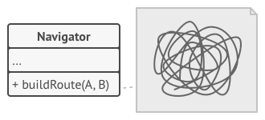
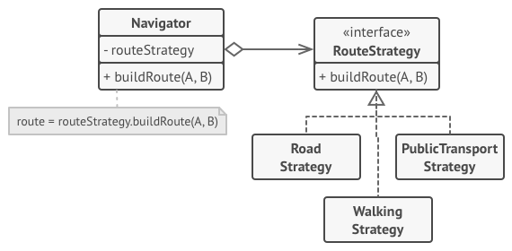
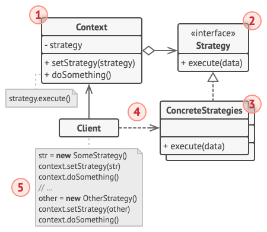

# Strategy

> [!NOTE]
> Estrategia

## Proposito

Strategy es un patrón de diseño de comportamiento que te permite definir una familia de algoritmos, colocar cada uno de ellos en una clase separada y hacer sus objetos intercambiables.

## Problema

Un día decidiste crear una aplicación de navegación para viajeros ocasionales. La aplicación giraba alrededor de un bonito mapa que ayudaba a los usuarios a orientarse rápidamente en cualquier ciudad.

Una de las funciones más solicitadas para la aplicación era la planificación automática de rutas. Un usuario debía poder introducir una dirección y ver la ruta más rápida a ese destino mostrado en el mapa.

La primera versión de la aplicación sólo podía generar las rutas sobre carreteras. Las personas que viajaban en coche estaban locas de alegría. Pero, aparentemente, no a todo el mundo le gusta conducir durante sus vacaciones. De modo que, en la siguiente actualización, añadiste una opción para crear rutas a pie. Después, añadiste otra opción para permitir a las personas utilizar el transporte público en sus rutas.

Sin embargo, esto era sólo el principio. Más tarde planeaste añadir la generación de rutas para ciclistas, y más tarde, otra opción para trazar rutas por todas las atracciones turísticas de una ciudad.

Aunque desde una perspectiva comercial la aplicación era un éxito, la parte técnica provocaba muchos dolores de cabeza. Cada vez que añadías un nuevo algoritmo de enrutamiento, la clase principal del navegador doblaba su tamaño. En cierto momento, la bestia se volvió demasiado difícil de mantener.

Cualquier cambio en alguno de los algoritmos, ya fuera un sencillo arreglo de un error o un ligero ajuste de la representación de la calle, afectaba a toda la clase, aumentando las probabilidades de crear un error en un código ya funcional.

Además, el trabajo en equipo se volvió ineficiente. Tus compañeros, contratados tras el exitoso lanzamiento, se quejaban de que dedicaban demasiado tiempo a resolver conflictos de integración. Implementar una nueva función te exige cambiar la misma clase enorme, entrando en conflicto con el código producido por otras personas.

## Solucion

El patrón Strategy sugiere que tomes esa clase que hace algo específico de muchas formas diferentes y extraigas todos esos algoritmos para colocarlos en clases separadas llamadas *estrategias*.

La clase original, llamada contexto, debe tener un campo para almacenar una referencia a una de las estrategias. El contexto delega el trabajo a un objeto de estrategia vinculado en lugar de ejecutarlo por su cuenta.

La clase contexto no es responsable de seleccionar un algoritmo adecuado para la tarea. En lugar de eso, el cliente pasa la estrategia deseada a la clase contexto. De hecho, la clase contexto no sabe mucho acerca de las estrategias. Funciona con todas las estrategias a través de la misma interfaz genérica, que sólo expone un único método para disparar el algoritmo encapsulado dentro de la estrategia seleccionada.

De esta forma, el contexto se vuelve independiente de las estrategias concretas, así que puedes añadir nuevos algoritmos o modificar los existentes sin cambiar el código de la clase contexto o de otras estrategias.

PEn nuestra aplicación de navegación, cada algoritmo de enrutamiento puede extraerse y ponerse en su propia clase con un único método ``crearRuta``. El método acepta un origen y un destino y devuelve una colección de puntos de control de la ruta.

Incluso contando con los mismos argumentos, cada clase de enrutamiento puede crear una ruta diferente. A la clase navegadora principal no le importa qué algoritmo se selecciona ya que su labor principal es representar un grupo de puntos de control en el mapa. La clase tiene un método para cambiar la estrategia activa de enrutamiento, de modo que sus clientes, como los botones en la interfaz de usuario, pueden sustituir el comportamiento seleccionado de enrutamiento por otro.

### Analogia

Imagina que tienes que llegar al aeropuerto. Puedes tomar el autobús, pedir un taxi o ir en bicicleta. Éstas son tus estrategias de transporte. Puedes elegir una de las estrategias, dependiendo de factores como el presupuesto o los límites de tiempo.

## Estructura

1. La clase **Contexto** mantiene una referencia a una de las estrategias concretas y se comunica con este objeto únicamente a través de la interfaz estrategia.

2. La interfaz **Estrategia** es común a todas las estrategias concretas. Declara un método que la clase contexto utiliza para ejecutar una estrategia.

3. Las **Estrategias Concretas** implementan distintas variaciones de un algoritmo que la clase contexto utiliza.

4. La clase contexto invoca el método de ejecución en el objeto de estrategia vinculado cada vez que necesita ejecutar el algoritmo. La clase contexto no sabe con qué tipo de estrategia funciona o cómo se ejecuta el algoritmo.

5. El Cliente crea un objeto de estrategia específico y lo pasa a la clase contexto. La clase contexto expone un modificador set que permite a los clientes sustituir la estrategia asociada al contexto durante el tiempo de ejecución.

## Aplicabilidad

- Utiliza el patrón Strategy cuando quieras utiliza distintas variantes de un algoritmo dentro de un objeto y poder cambiar de un algoritmo a otro durante el tiempo de ejecución.

- Utiliza el patrón Strategy cuando tengas muchas clases similares que sólo se diferencien en la forma en que ejecutan cierto comportamiento.

- Utiliza el patrón para aislar la lógica de negocio de una clase, de los detalles de implementación de algoritmos que pueden no ser tan importantes en el contexto de esa lógica.

- Utiliza el patrón cuando tu clase tenga un enorme operador condicional que cambie entre distintas variantes del mismo algoritmo.

## Como Usarlo

1. En la clase contexto, identifica un algoritmo que tienda a sufrir cambios frecuentes. También puede ser un enorme condicional que seleccione y ejecute una variante del mismo algoritmo durante el tiempo de ejecución.

2. Declara la interfaz estrategia común a todas las variantes del algoritmo.

3. Uno a uno, extrae todos los algoritmos y ponlos en sus propias clases. Todas deben implementar la misma interfaz estrategia.

4. En la clase contexto, añade un campo para almacenar una referencia a un objeto de estrategia. Proporciona un modificador set para sustituir valores de ese campo. La clase contexto debe trabajar con el objeto de estrategia únicamente a través de la interfaz estrategia. La clase contexto puede definir una interfaz que permita a la estrategia acceder a sus datos.

5. Los clientes de la clase contexto deben asociarla con una estrategia adecuada que coincida con la forma en la que esperan que la clase contexto realice su trabajo principal.

## Pros y contras

Pros  | Contras
------------- | -------------
Puedes intercambiar algoritmos usados dentro de un objeto durante el tiempo de ejecución.  |  Si sólo tienes un par de algoritmos que raramente cambian, no hay una razón real para complicar el programa en exceso con nuevas clases e interfaces que vengan con el patrón.
Puedes aislar los detalles de implementación de un algoritmo del código que lo utiliza.  |  Los clientes deben conocer las diferencias entre estrategias para poder seleccionar la adecuada.
Puedes sustituir la herencia por composición.  |  Muchos lenguajes de programación modernos tienen un soporte de tipo funcional que te permite implementar distintas versiones de un algoritmo dentro de un grupo de funciones anónimas. Entonces puedes utilizar estas funciones exactamente como habrías utilizado los objetos de estrategia, pero sin saturar tu código con clases e interfaces adicionales.
Principio de abierto/cerrado. Puedes introducir nuevas estrategias sin tener que cambiar el contexto.  |  