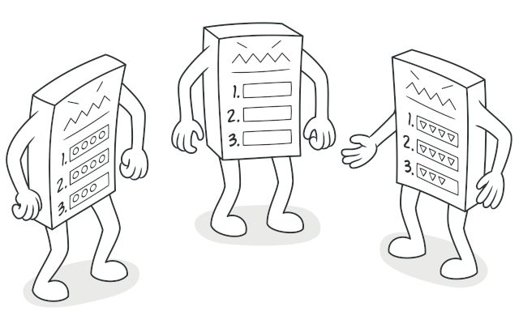
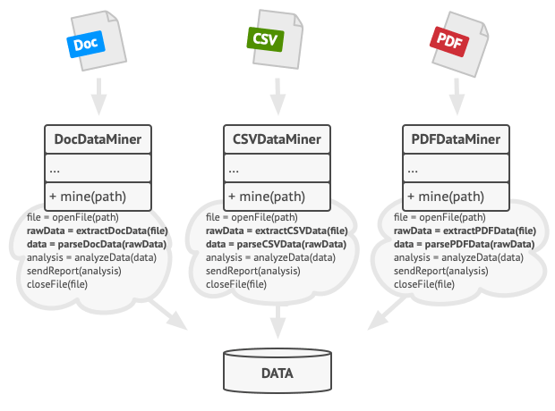
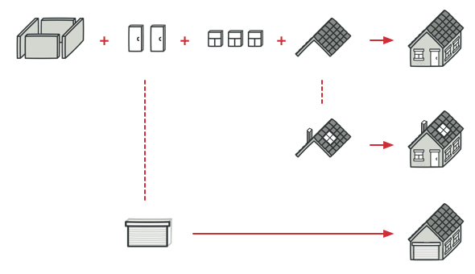
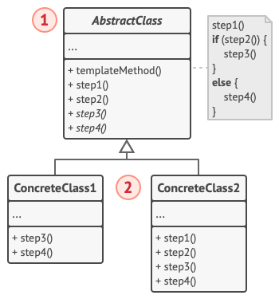
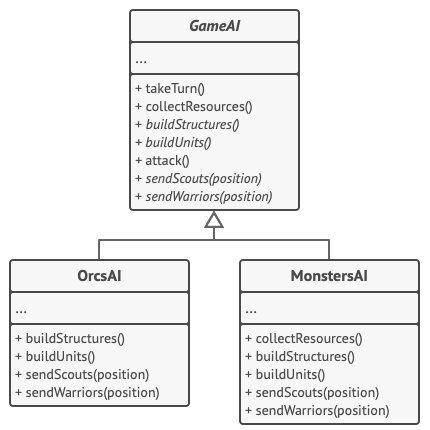

# Template Method

> [!NOTE]
> Metodo plantilla

## Proposito

Template Method es un patrón de diseño de comportamiento que define el esqueleto de un algoritmo en la superclase pero permite que las subclases sobrescriban pasos del algoritmo sin cambiar su estructura.

## Problema

Imagina que estás creando una aplicación de minería de datos que analiza documentos corporativos. Los usuarios suben a la aplicación documentos en varios formatos (PDF, DOC, CSV) y ésta intenta extraer la información relevante de estos documentos en un formato uniforme.

La primera versión de la aplicación sólo funcionaba con archivos DOC. La siguiente versión podía soportar archivos CSV. Un mes después, le “enseñaste” a extraer datos de archivos PDF.

En cierto momento te das cuenta de que las tres clases tienen mucho código similar. Aunque el código para gestionar distintos formatos de datos es totalmente diferente en todas las clases, el código para procesar y analizar los datos es casi idéntico. ¿No sería genial deshacerse de la duplicación de código, dejando intacta la estructura del algoritmo?

Hay otro problema relacionado con el código cliente que utiliza esas clases. Tiene muchos condicionales que eligen un curso de acción adecuado dependiendo de la clase del objeto de procesamiento. Si las tres clases de procesamiento tienen una interfaz común o una clase base, puedes eliminar los condicionales en el código cliente y utilizar el polimorfismo al invocar métodos en un objeto de procesamiento.

## Solucion

Al principio, podemos declarar todos los pasos como ``abstractos``, forzando a las subclases a proporcionar sus propias implementaciones para estos métodos. En nuestro caso, las subclases ya cuentan con todas las implementaciones necesarias, por lo que lo único que tendremos que hacer es ajustar las firmas de los métodos para que coincidan con los métodos de la superclase.

Ahora, veamos lo que podemos hacer para deshacernos del código duplicado. Parece que el código para abrir/cerrar archivos y extraer/analizar información es diferente para varios formatos de datos, por lo que no tiene sentido tocar estos métodos. No obstante, la implementación de otros pasos, como analizar los datos sin procesar y generar informes, es muy similar, por lo que puede meterse en la clase base, donde las subclases pueden compartir ese código.

Como puedes ver, tenemos dos tipos de pasos:

- Los pasos abstractos deben ser implementados por todas las subclases
- Los pasos opcionales ya tienen cierta implementación por defecto, pero aún así pueden sobrescribirse si es necesario.

Hay otro tipo de pasos, llamados ganchos (hooks). Un gancho es un paso opcional con un cuerpo vacío. Un método plantilla funcionará aunque el gancho no se sobrescriba. Normalmente, los ganchos se colocan antes y después de pasos cruciales de los algoritmos, suministrando a las subclases puntos adicionales de extensión para un algoritmo.

### Analogia

El enfoque del método plantilla puede emplearse en la construcción de viviendas en masa. El plan arquitectónico para construir una casa estándar puede contener varios puntos de extensión que permitirán a un potencial propietario ajustar algunos detalles de la casa resultante.

Cada paso de la construcción, como colocar los cimientos, el armazón, construir las paredes, instalar las tuberías para el agua y el cableado para la electricidad, etc., puede cambiarse ligeramente para que la casa resultante sea un poco diferente de las demás.

## Estructura

1. La **Clase Abstracta** declara métodos que actúan como pasos de un algoritmo, así como el propio método plantilla que invoca estos métodos en un orden específico. Los pasos pueden declararse ``abstractos`` o contar con una implementación por defecto.

2. Las **Clases Concretas** pueden sobrescribir todos los pasos, pero no el propio método plantilla.

## Implementacion

En este ejemplo, el patrón Template Method proporciona un “esqueleto” para varias ramas de inteligencia artificial (IA) en un sencillo videojuego de estrategia.

## Aplicabilidad

- Utiliza el patrón Template Method cuando quieras permitir a tus clientes que extiendan únicamente pasos particulares de un algoritmo, pero no todo el algoritmo o su estructura.

- Utiliza el patrón cuando tengas muchas clases que contengan algoritmos casi idénticos, pero con algunas diferencias mínimas. Como resultado, puede que tengas que modificar todas las clases cuando el algoritmo cambie.

## Como Usarlo

1. Analiza el algoritmo objetivo para ver si puedes dividirlo en pasos. Considera qué pasos son comunes a todas las subclases y cuáles siempre serán únicos

2. Crea la clase base abstracta y declara el método plantilla y un grupo de métodos abstractos que representen los pasos del algoritmo. Perfila la estructura del algoritmo en el método plantilla ejecutando los pasos correspondientes. Considera declarar el método plantilla como ``final`` para evitar que las subclases lo sobrescriban.

3. No hay problema en que todos los pasos acaben siendo abstractos. Sin embargo, a algunos pasos les vendría bien tener una implementación por defecto. Las subclases no tienen que implementar esos métodos.

4. Piensa en añadir ganchos entre los pasos cruciales del algoritmo.

5. Para cada variación del algoritmo, crea una nueva subclase concreta. Ésta debe implementar todos los pasos abstractos, pero también puede sobrescribir algunos de los opcionales.

## Pros y contras

Pros  | Contras
------------- | -------------
Puedes permitir a los clientes que sobrescriban tan solo ciertas partes de un algoritmo grande, para que les afecten menos los cambios que tienen lugar en otras partes del algoritmo.  |  Algunos clientes pueden verse limitados por el esqueleto proporcionado de un algoritmo.
Puedes colocar el código duplicado dentro de una superclase.  |  Puede que violes el principio de sustitución de Liskov suprimiendo una implementación por defecto de un paso a través de una subclase.
.  |  Los métodos plantilla tienden a ser más difíciles de mantener cuantos más pasos tengan