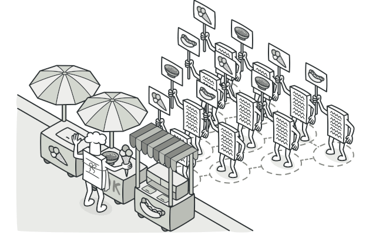
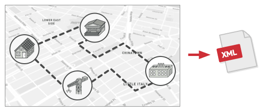
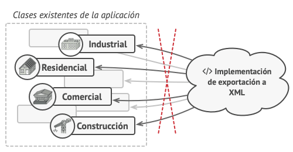
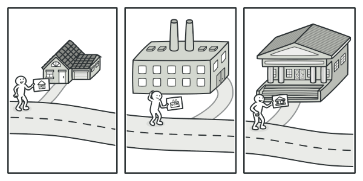
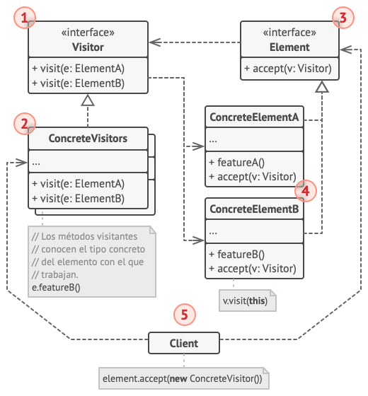
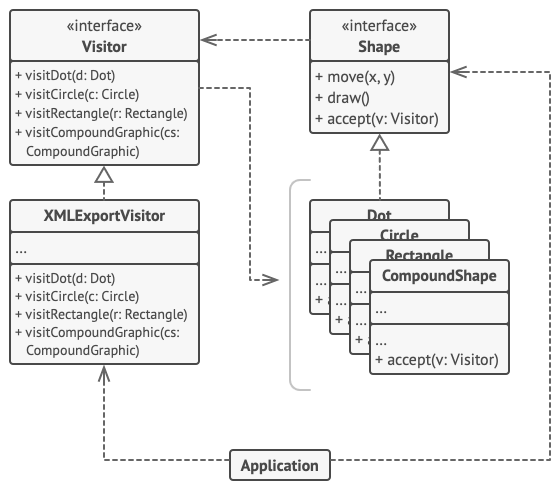

# Visitor

> [!NOTE]
> Visitante

## Proposito

Visitor es un patrón de diseño de comportamiento que te permite separar algoritmos de los objetos sobre los que operan.

## Problema

Imagina que tu equipo desarrolla una aplicación que funciona con información geográfica estructurada como un enorme grafo. Cada nodo del grafo puede representar una entidad compleja, como una ciudad, pero también cosas más específicas, como industrias, áreas turísticas, etc. Los nodos están conectados con otros si hay un camino entre los objetos reales que representan. Técnicamente, cada tipo de nodo está representado por su propia clase, mientras que cada nodo específico es un objeto.

En cierto momento, te surge la tarea de implementar la exportación del grafo a formato XML. Al principio, el trabajo parece bastante sencillo. Planificaste añadir un método de exportación a cada clase de nodo y después aprovechar la recursión para recorrer cada nodo del grafo, ejecutando el método de exportación. La solución era sencilla y elegante: gracias al polimorfismo, no acoplabas el código que invocaba el método de exportación a clases concretas de nodos.

Lamentablemente, el arquitecto del sistema no te permitió alterar las clases de nodo existentes. Dijo que el código ya estaba en producción y no quería arriesgarse a que se descompusiera por culpa de un potencial error en tus cambios.

Además, cuestionó si tenía sentido tener el código de exportación XML dentro de las clases de nodo. El trabajo principal de estas clases era trabajar con geodatos. El comportamiento de la exportación XML resultaría extraño ahí.

Había otra razón para el rechazo. Era muy probable que, una vez que se implementara esta función, alguien del departamento de marketing te pidiera que incluyeras la capacidad de exportar a otros formatos, o te pidiera alguna otra cosa extraña. Esto te forzaría a cambiar de nuevo esas preciadas y frágiles clases.

## Solucion

El patrón Visitor sugiere que coloques el nuevo comportamiento en una clase separada llamada visitante, en lugar de intentar integrarlo dentro de clases existentes. El objeto que originalmente tenía que realizar el comportamiento se pasa ahora a uno de los métodos del visitante como argumento, de modo que el método accede a toda la información necesaria contenida dentro del objeto.

Ahora, ¿qué pasa si ese comportamiento puede ejecutarse sobre objetos de clases diferentes? Por ejemplo, en nuestro caso con la exportación XML, la implementación real probablemente sería un poco diferente en varias clases de nodo. Por lo tanto, la clase visitante puede definir un grupo de métodos en lugar de uno solo, y cada uno de ellos podría tomar argumentos de distintos tipos, así:

class ExportVisitor implements Visitor is
    method doForCity(City c) { ... }
    method doForIndustry(Industry f) { ... }
    method doForSightSeeing(SightSeeing ss) { ... }
    // ...

Pero, ¿cómo llamaríamos exactamente a estos métodos, sobre todo al lidiar con el grafo completo? Estos métodos tienen distintas firmas, por lo que no podemos utilizar el polimorfismo. Para elegir un método visitante adecuado que sea capaz de procesar un objeto dado, debemos revisar su clase. ¿No suena esto como una pesadilla?

foreach (Node node in graph)
    if (node instanceof City)
        exportVisitor.doForCity((City) node)
    if (node instanceof Industry)
        exportVisitor.doForIndustry((Industry) node)
    // ...
}

Puede que te preguntes, ¿por qué no utilizar la sobrecarga de métodos? Eso es cuando le das a todos los métodos el mismo nombre, incluso cuando soportan distintos grupos de parámetros. Lamentablemente, incluso asumiendo que nuestro lenguaje de programación la soportara (como Java y C#), no nos ayudaría. Debido a que la clase exacta de un objeto tipo nodo es desconocida de antemano, el mecanismo de sobrecarga no será capaz de determinar el método correcto a ejecutar. Recurrirá por defecto al método que toma un objeto de la clase base ``Nodo.``

Sin embargo, el patrón Visitor ataja este problema. Utiliza una técnica llamada Double Dispatch, que ayuda a ejecutar el método adecuado sobre un objeto sin complicados condicionales. En lugar de permitir al cliente seleccionar una versión adecuada del método a llamar, ¿qué tal si delegamos esta opción a los objetos que pasamos al visitante como argumento? Como estos objetos conocen sus propias clases, podrán elegir un método adecuado en el visitante más fácilmente. “Aceptan” un visitante y le dicen qué método visitante debe ejecutarse.

// Código cliente
foreach (Node node in graph)
    node.accept(exportVisitor)

// Ciudad
class City is
    method accept(Visitor v) is
        v.doForCity(this)
    // ...

// Industria
class Industry is
    method accept(Visitor v) is
        v.doForIndustry(this)
    // ...

Lo confieso. Hemos tenido que cambiar las clases de nodo, después de todo. Pero al menos el cambio es trivial y nos permite añadir más comportamientos sin alterar el código otra vez.

Ahora, si extraemos una interfaz común para todos los visitantes, todos los nodos existentes pueden funcionar con cualquier visitante que introduzcas en la aplicación. Si te encuentras introduciendo un nuevo comportamiento relacionado con los nodos, todo lo que tienes que hacer es implementar una nueva clase visitante.

### Analogia

Imagina un experimentado agente de seguros que está deseoso de conseguir nuevos clientes. Puede visitar todos los edificios de un barrio, intentando vender seguros a todo aquel que se va encontrando. Dependiendo del tipo de organización que ocupe el edificio, puede ofrecer pólizas de seguro especializadas:

- Si es un edificio residencial, vende seguros médicos.
- Si es un banco, vende seguros contra robos.
- Si es una cafetería, vende seguros contra incendios e inundaciones.

## Estructura

1. La interfaz **Visitante** declara un grupo de métodos visitantes que pueden tomar elementos concretos de una estructura de objetos como argumentos. Estos métodos pueden tener los mismos nombres si el programa está escrito en un lenguaje que soporte la sobrecarga, pero los tipos de sus parámetros deben ser diferentes.

2. Cada **Visitante Concreto** implementa varias versiones de los mismos comportamientos, personalizadas para las distintas clases de elemento concreto.

3. La interfaz **Elemento** declara un método para “aceptar” visitantes. Este método deberá contar con un parámetro declarado con el tipo de la interfaz visitante.

4. Cada **Elemento Concreto** debe implementar el método de aceptación. El propósito de este método es redirigir la llamada al método adecuado del visitante correspondiente a la clase de elemento actual. Piensa que, aunque una clase base de elemento implemente este método, todas las subclases deben sobrescribir este método en sus propias clases e invocar el método adecuado en el objeto visitante.

5. El **Cliente** representa normalmente una colección o algún otro objeto complejo (por ejemplo, un árbol **Composite**). A menudo, los clientes no son conscientes de todas las clases de elemento concreto porque trabajan con objetos de esa colección a través de una interfaz abstracta.

## Implementacion

En este ejemplo, el patrón Visitor añade soporte de exportación XML a la jerarquía de clases de formas geométricas.

## Aplicabilidad

- Utiliza el patrón Visitor cuando necesites realizar una operación sobre todos los elementos de una compleja estructura de objetos (por ejemplo, un árbol de objetos).

- Utiliza el patrón Visitor para limpiar la lógica de negocio de comportamientos auxiliares.

- Utiliza el patrón cuando un comportamiento solo tenga sentido en algunas clases de una jerarquía de clases, pero no en otras.

## Como Usarlo

1. Declara la interfaz visitante con un grupo de métodos “visitantes”, uno por cada clase de elemento concreto existente en el programa.

2. Declara la interfaz de elemento. Si estás trabajando con una jerarquía de clases de elemento existente, añade el método abstracto de “aceptación” a la clase base de la jerarquía. Este método debe aceptar un objeto visitante como argumento.

3. Implementa los métodos de aceptación en todas las clases de elemento concreto. Estos métodos simplemente deben redirigir la llamada a un método visitante en el objeto visitante entrante que coincida con la clase del elemento actual.

4. Las clases de elemento sólo deben funcionar con visitantes a través de la interfaz visitante. Los visitantes, sin embargo, deben conocer todas las clases de elemento concreto, referenciadas como tipos de parámetro de los métodos de visita.

5. Por cada comportamiento que no pueda implementarse dentro de la jerarquía de elementos, crea una nueva clase concreta visitante e implementa todos los métodos visitantes

> [!NOTE]
> Puede que te encuentres una situación en la que el visitante necesite acceso a algunos miembros privados de la clase elemento. En este caso, puedes hacer estos campos o métodos públicos, violando la encapsulación del elemento, o anidar la clase visitante en la clase elemento. Esto último sólo es posible si tienes la suerte de trabajar con un lenguaje de programación que soporte clases anidadas.

6. El cliente debe crear objetos visitantes y pasarlos dentro de elementos a través de métodos de “aceptación”.

## Pros y contras

Pros  | Contras
------------- | -------------
Principio de abierto/cerrado. Puedes introducir un nuevo comportamiento que puede funcionar con objetos de clases diferentes sin cambiar esas clases.  |  Debes actualizar todos los visitantes cada vez que una clase se añada o elimine de la jerarquía de elementos.
Principio de responsabilidad única. Puedes tomar varias versiones del mismo comportamiento y ponerlas en la misma clase.  |  Los visitantes pueden carecer del acceso necesario a los campos y métodos privados de los elementos con los que se supone que deben trabajar.
Un objeto visitante puede acumular cierta información útil mientras trabaja con varios objetos. Esto puede resultar útil cuando quieras atravesar una compleja estructura de objetos, como un árbol de objetos, y aplicar el visitante a cada objeto de esa estructura.  |  
