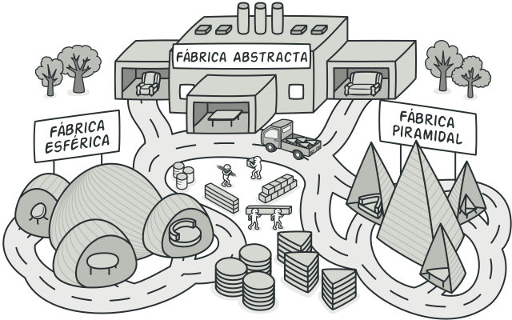
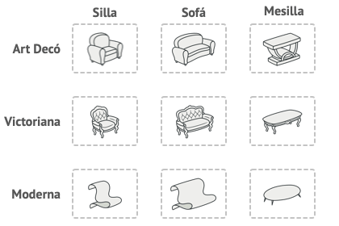
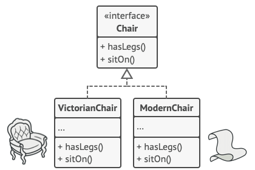
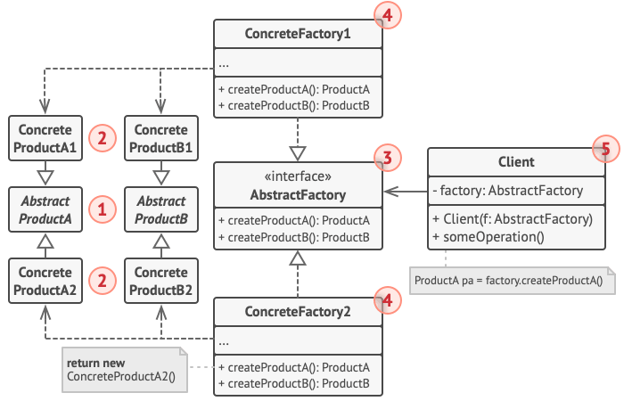
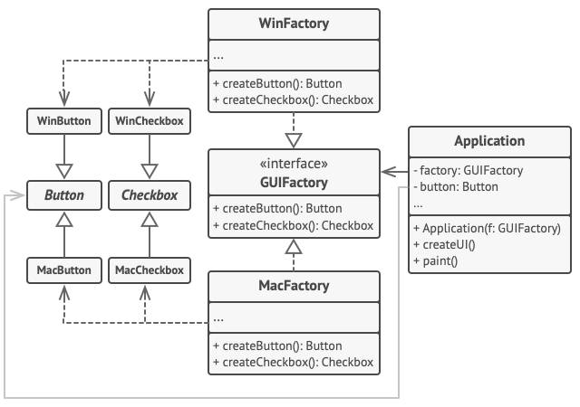

# Abstract Factory

> [!NOTE]
> Fábrica abstracta

## Proposito

Abstract Factory es un patrón de diseño creacional que nos permite producir familias de objetos relacionados sin especificar sus clases concretas.

## Problema

Imagina que estás creando un simulador de tienda de muebles. Tu código está compuesto por clases que representan lo siguiente:

Una familia de productos relacionados, digamos: ``Silla`` + ``Sofá`` + ``Mesilla``.

Algunas variantes de esta familia. Por ejemplo, los productos ``Silla`` + ``Sofá`` + ``Mesilla`` están disponibles en estas variantes: ``Moderna``, ``Victoriana``, ``ArtDecó``.

Necesitamos una forma de crear objetos individuales de mobiliario para que combinen con otros objetos de la misma familia. Los clientes se enfadan bastante cuando reciben muebles que no combinan.

Además, no queremos cambiar el código existente al añadir al programa nuevos productos o familias de productos. Los comerciantes de muebles actualizan sus catálogos muy a menudo, y debemos evitar tener que cambiar el código principal cada vez que esto ocurra.

## Solucion

Lo primero que sugiere el patrón Abstract Factory es que declaremos de forma explícita interfaces para cada producto diferente de la familia de productos (por ejemplo, silla, sofá o mesilla). Después podemos hacer que todas las variantes de los productos sigan esas interfaces. Por ejemplo, todas las variantes de silla pueden implementar la interfaz ``Silla``, así como todas las variantes de mesilla pueden implementar la interfaz ``Mesilla``, y así sucesivamente.

El siguiente paso consiste en declarar la Fábrica abstracta: una interfaz con una lista de métodos de creación para todos los productos que son parte de la familia de productos (por ejemplo, ``crearSilla``, ``crearSofá`` y ``crearMesilla``). Estos métodos deben devolver productos abstractos representados por las interfaces que extrajimos previamente: ``Silla``, ``Sofá``, ``Mesilla``, etc.

Ahora bien, ¿qué hay de las variantes de los productos? Para cada variante de una familia de productos, creamos una clase de fábrica independiente basada en la interfaz ``FábricaAbstracta``. Una fábrica es una clase que devuelve productos de un tipo particular. Por ejemplo, la ``FábricadeMueblesModernos`` sólo puede crear objetos de ``SillaModerna``, ``SofáModerno`` y ``MesillaModerna``.

El código cliente tiene que funcionar con fábricas y productos a través de sus respectivas interfaces abstractas. Esto nos permite cambiar el tipo de fábrica que pasamos al código cliente, así como la variante del producto que recibe el código cliente, sin descomponer el propio código cliente.

Digamos que el cliente quiere una fábrica para producir una silla. El cliente no tiene que conocer la clase de la fábrica y tampoco importa el tipo de silla que obtiene. Ya sea un modelo moderno o una silla de estilo victoriano, el cliente debe tratar a todas las sillas del mismo modo, utilizando la interfaz abstracta ``Silla``. Con este sistema, lo único que sabe el cliente sobre la silla es que implementa de algún modo el método ``sentarse``. Además, sea cual sea la variante de silla devuelta, siempre combinará con el tipo de sofá o mesilla producida por el mismo objeto de fábrica.

> [!NOTE]
> Queda otro punto por aclarar: si el cliente sólo está expuesto a las interfaces abstractas, ¿cómo se crean los objetos de fábrica? Normalmente, la aplicación crea un objeto de fábrica concreto en la etapa de inicialización. Justo antes, la aplicación debe seleccionar el tipo de fábrica, dependiendo de la configuración o de los ajustes del entorno.

## Estructura

1. Los **Productos Abstractos** declaran interfaces para un grupo de productos diferentes pero relacionados que forman una familia de productos.

2. Los **Productos Concretos** son implementaciones distintas de productos abstractos agrupados por variantes. Cada producto abstracto (silla/sofá) debe implementarse en todas las variantes dadas (victoriano/moderno).

3. La interfaz **Fábrica Abstracta** declara un grupo de métodos para crear cada uno de los productos abstractos.

4. Las **Fábricas Concretas** implementan métodos de creación de la fábrica abstracta. Cada fábrica concreta se corresponde con una variante específica de los productos y crea tan solo dichas variantes de los productos.

5. Aunque las fábricas concretas instancian productos concretos, las firmas de sus métodos de creación deben devolver los productos abstractos correspondientes. De este modo, el código cliente que utiliza una fábrica no se acopla a la variante específica del producto que obtiene de una fábrica. El Cliente puede funcionar con cualquier variante fábrica/producto concreta, siempre y cuando se comunique con sus objetos a través de interfaces abstractas.

## Implementacion

## Aplicabilidad

- Utiliza el patrón Abstract Factory cuando tu código deba funcionar con varias familias de productos relacionados, pero no desees que dependa de las clases concretas de esos productos, ya que puede ser que no los conozcas de antemano o sencillamente quieras permitir una futura extensibilidad.

- Considera la implementación del patrón Abstract Factory cuando tengas una clase con un grupo de métodos de fábrica que nublen su responsabilidad principal.

## Pros y contras

Pros  | Contras
------------- | -------------
Puedes tener la certeza de que los productos que obtienes de una fábrica son compatibles entre sí.  | Puede ser que el código se complique, ya que debes incorporar una multitud de nuevas subclases para implementar el patrón. La situación ideal sería introducir el patrón en una jerarquía existente de clases creadoras.
Evitas un acoplamiento fuerte entre productos concretos y el código cliente.  |  
Principio de responsabilidad única. Puedes mover el código de creación de productos a un solo lugar, haciendo que el código sea más fácil de mantener  |  
*Principio de abierto/cerrado.* Puedes introducir nuevas variantes de productos sin descomponer el código cliente existente.  |  