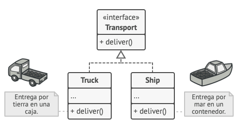
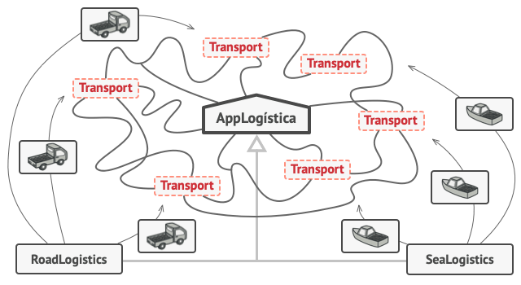
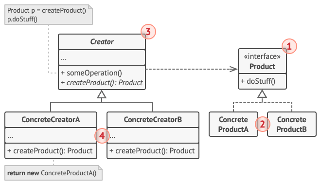

# Factory Method

> [!NOTE]
> Método fábrica, Constructor virtual

## Proposito

Factory Method es un patrón de diseño creacional que proporciona una interfaz para crear objetos en una superclase, mientras permite a las subclases alterar el tipo de objetos que se crearán.

## Problema

Imagina que estás creando una aplicación de gestión logística. La primera versión de tu aplicación sólo es capaz de manejar el transporte en camión, por lo que la mayor parte de tu código se encuentra dentro de la clase `Camión`.

Al cabo de un tiempo, tu aplicación se vuelve bastante popular. 

Cada día recibes decenas de peticiones de empresas de transporte marítimo para que incorpores la logística por mar a la aplicación.

La situación esta que la mayour parte del codigo está acoplado a la clase `Camión`. Para añadir barcos a la aplicación habría que hacer cambios en toda la base del código. Además, si más tarde decides añadir otro tipo de transporte a la aplicación, probablemente tendrás que volver a hacer todos estos cambios.

Al final acabarás con un código bastante sucio, plagado de condicionales que cambian el comportamiento de la aplicación dependiendo de la clase de los objetos de transporte.

## Solucion

El patrón Factory Method sugiere que, en lugar de llamar al operador `new` para construir objetos directamente, se invoque a un método fábrica especial. No te preocupes: los objetos se siguen creando a través del operador `new`, pero se invocan desde el método fábrica. Los objetos devueltos por el método fábrica a menudo se denominan *productos*

A simple vista, puede parecer que este cambio no tiene sentido, ya que tan solo hemos cambiado el lugar desde donde invocamos al constructor. Sin embargo, piensa en esto: ahora puedes sobrescribir el método fábrica en una subclase y cambiar la clase de los productos creados por el método.

No obstante, hay una pequeña limitación: las subclases sólo pueden devolver productos de distintos tipos si dichos productos tienen una clase base o interfaz común. Además, el método fábrica en la clase base debe tener su tipo de retorno declarado como dicha interfaz.

Por ejemplo, tanto la clase `Camión` como la clase ``Barco`` deben implementar la interfaz ``Transporte``, que declara un método llamado ``entrega``. Cada clase implementa este método de forma diferente: los camiones entregan su carga por tierra, mientras que los barcos lo hacen por mar. El método fábrica dentro de la clase ``LogísticaTerrestre`` devuelve objetos de tipo camión, mientras que el método fábrica de la clase ``LogísticaMarítima`` devuelve barcos.

El código que utiliza el método fábrica (a menudo denominado código cliente) no encuentra diferencias entre los productos devueltos por varias subclases, y trata a todos los productos como la clase abstracta ``Transporte``. El cliente sabe que todos los objetos de transporte deben tener el método ``entrega``, pero no necesita saber cómo funciona exactamente.

## Estructura

1. El Producto declara la interfaz, que es común a todos los objetos que puede producir la clase creadora y sus subclases.

2. Los Productos Concretos son distintas implementaciones de la interfaz de producto.

3. La clase Creadora declara el método fábrica que devuelve nuevos objetos de producto. Es importante que el tipo de retorno de este método coincida con la interfaz de producto.
Puedes declarar el patrón Factory Method como abstracto para forzar a todas las subclases a implementar sus propias versiones del método. Como alternativa, el método fábrica base puede devolver algún tipo de producto por defecto.

> [!NOTE]
>Observa que, a pesar de su nombre, la creación de producto no es la principal responsabilidad de la clase creadora. Normalmente, esta clase cuenta con alguna lógica de negocios central relacionada con los productos. El patrón Factory Method ayuda a desacoplar esta lógica de las clases concretas de producto. Aquí tienes una analogía: una gran empresa de desarrollo de software puede contar con un departamento de formación de programadores. Sin embargo, la principal función de la empresa sigue siendo escribir código, no preparar programadores.

4. Los Creadores Concretos sobrescriben el Factory Method base, de modo que devuelva un tipo diferente de producto.

> [!NOTE]
> Observa que el método fábrica no tiene que crear nuevas instancias todo el tiempo. También puede devolver objetos existentes de una memoria caché, una agrupación de objetos, u otra fuente.

## Aplicabilidad

- Utiliza el Método Fábrica cuando no conozcas de antemano las dependencias y los tipos exactos de los objetos con los que deba funcionar tu código.

- Utiliza el Factory Method cuando quieras ofrecer a los usuarios de tu biblioteca o framework, una forma de extender sus componentes internos.

- Utiliza el Factory Method cuando quieras ahorrar recursos del sistema mediante la reutilización de objetos existentes en lugar de reconstruirlos cada vez.

## Pros y contras

Pros  | Contras
------------- | -------------
 Evitas un acoplamiento fuerte entre el creador y los productos concretos.  | Puede ser que el código se complique, ya que debes incorporar una multitud de nuevas subclases para implementar el patrón. La situación ideal sería introducir el patrón en una jerarquía existente de clases creadoras.
Principio de responsabilidad única. Puedes mover el código de creación de producto a un lugar del programa, haciendo que el código sea más fácil de mantener.  |  
 Principio de abierto/cerrado. Puedes incorporar nuevos tipos de productos en el programa sin descomponer el código cliente existente.  |  
