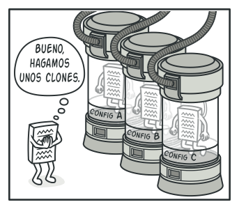
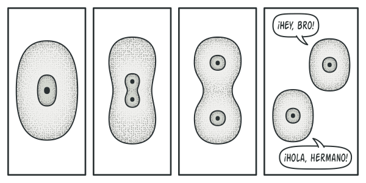
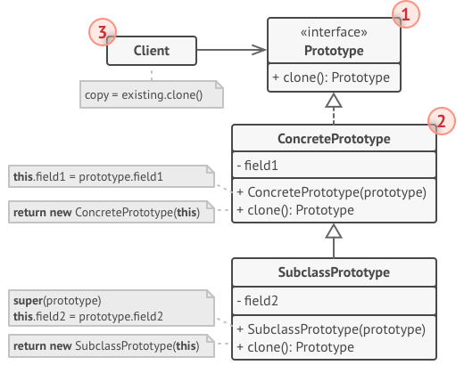
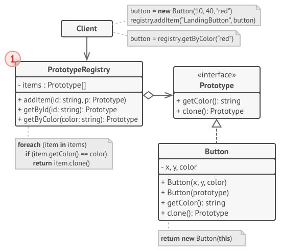

# Prototype

> [!NOTE]
> Prototipo, Clon, Clone

## Proposito

Prototype es un patrón de diseño creacional que nos permite copiar objetos existentes sin que el código dependa de sus clases.

## Problema

Digamos que tienes un objeto y quieres crear una copia exacta de él. ¿Cómo lo harías? En primer lugar, debes crear un nuevo objeto de la misma clase. Después debes recorrer todos los campos del objeto original y copiar sus valores en el nuevo objeto.

¡Bien! Pero hay una trampa. No todos los objetos se pueden copiar de este modo, porque algunos de los campos del objeto pueden ser privados e invisibles desde fuera del propio objeto.

Hay otro problema con el enfoque directo. Dado que debes conocer la clase del objeto para crear un duplicado, el código se vuelve dependiente de esa clase. Si esta dependencia adicional no te da miedo, todavía hay otra trampa. En ocasiones tan solo conocemos la interfaz que sigue el objeto, pero no su clase concreta, cuando, por ejemplo, un parámetro de un método acepta cualquier objeto que siga cierta interfaz.

## Solucion

El patrón Prototype delega el proceso de clonación a los propios objetos que están siendo clonados. El patrón declara una interfaz común para todos los objetos que soportan la clonación. Esta interfaz nos permite clonar un objeto sin acoplar el código a la clase de ese objeto. Normalmente, dicha interfaz contiene un único método ``clonar``.

La implementación del método ``clonar`` es muy parecida en todas las clases. El método crea un objeto a partir de la clase actual y lleva todos los valores de campo del viejo objeto, al nuevo. Se puede incluso copiar campos privados, porque la mayoría de los lenguajes de programación permite a los objetos acceder a campos privados de otros objetos que pertenecen a la misma clase.

Un objeto que soporta la clonación se denomina prototipo. Cuando tus objetos tienen decenas de campos y miles de configuraciones posibles, la clonación puede servir como alternativa a la creación de subclases.

> [!NOTE]
> Funciona así: se crea un grupo de objetos configurados de maneras diferentes. Cuando necesites un objeto como el que has configurado, clonas un prototipo en lugar de construir un nuevo objeto desde cero.

### Analogia Real

En la vida real, los prototipos se utilizan para realizar pruebas de todo tipo antes de comenzar con la producción en masa de un producto. Sin embargo, en este caso, los prototipos no forman parte de una producción real, sino que juegan un papel pasivo.

Ya que los prototipos industriales en realidad no se copian a sí mismos, una analogía más precisa del patrón es el proceso de la división mitótica de una célula (biología, ¿recuerdas?). Tras la división mitótica, se forma un par de células idénticas. La célula original actúa como prototipo y asume un papel activo en la creación de la copia.

## Estructura

1. La interfaz **Prototipo** declara los métodos de clonación. En la mayoría de los casos, se trata de un único método clonar.

2. La clase **Prototipo Concreto** implementa el método de clonación. Además de copiar la información del objeto original al clon, este método también puede gestionar algunos casos extremos del proceso de clonación, como, por ejemplo, clonar objetos vinculados, deshacer dependencias recursivas, etc.

3. El **Cliente** puede producir una copia de cualquier objeto que siga la interfaz del prototipo.

### Registro de Prototipos

> [!IMPORTANT] 
> Almacena un grupo de objetos prefabricados listos para ser copiados. El registro de prototipos más sencillo es una tabla hash con los pares ``name → prototype.`` No obstante, si necesitas un criterio de búsqueda más preciso que un simple nombre, puedes crear una versión mucho más robusta del registro.

## Implementacion

## Aplicabilidad

- Utiliza el patrón Prototype cuando tu código no deba depender de las clases concretas de objetos que necesites copiar.

- Utiliza el patrón cuando quieras reducir la cantidad de subclases que solo se diferencian en la forma en que inicializan sus respectivos objetos. Puede ser que alguien haya creado estas subclases para poder crear objetos con una configuración específica.

## Como Usarlo

1. Crea la interfaz del prototipo y declara el método ``clonar`` en ella, o, simplemente, añade el método a todas las clases de una jerarquía de clase existente, si la tienes.

2. Una clase de prototipo debe definir el constructor alternativo que acepta un objeto de dicha clase como argumento. El constructor debe copiar los valores de todos los campos definidos en la clase del objeto que se le pasa a la instancia recién creada. Si deseas cambiar una subclase, debes invocar al constructor padre para permitir que la superclase gestione la clonación de sus campos privados.

> [!NOTE]
> Si el lenguaje de programación que utilizas no soporta la sobrecarga de métodos, puedes definir un método especial para copiar la información del objeto. El constructor es el lugar más adecuado para hacerlo, porque entrega el objeto resultante justo después de invocar el operador ``new``.

3. Normalmente, el método de clonación consiste en una sola línea que ejecuta un operador ``new`` con la versión prototípica del constructor. Observa que todas las clases deben sobreescribir explícitamente el método de clonación y utilizar su propio nombre de clase junto al operador ``new``. De lo contrario, el método de clonación puede producir un objeto a partir de una clase madre

4. Opcionalmente, puedes crear un registro de prototipos centralizado para almacenar un catálogo de prototipos de uso frecuente.

## Pros y contras

Pros  | Contras
------------- | -------------
Puedes clonar objetos sin acoplarlos a sus clases concretas.  | Clonar objetos complejos con referencias circulares puede resultar complicado.
Puedes evitar un código de inicialización repetido clonando prototipos prefabricados.  |  
Puedes crear objetos complejos con más facilidad.  |  
Obtienes una alternativa a la herencia al tratar con preajustes de configuración para objetos complejos.  |  