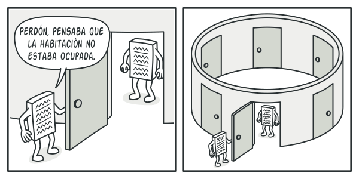
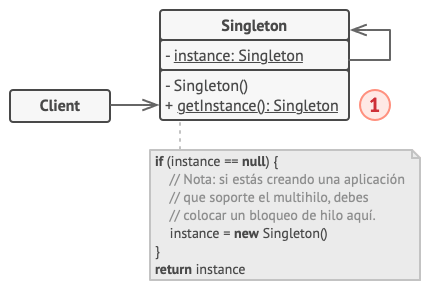

# Singleton

> [!NOTE]
> Constructor

## Proposito

Builder es un patrón de diseño creacional que nos permite construir objetos complejos paso a paso. El patrón nos permite producir distintos tipos y representaciones de un objeto empleando el mismo código de construcción.

## Problema

Imagina un objeto complejo que requiere una inicialización laboriosa, paso a paso, de muchos campos y objetos anidados. Normalmente, este código de inicialización está sepultado dentro de un monstruoso constructor con una gran cantidad de parámetros. O, peor aún: disperso por todo el código cliente.

Por ejemplo, pensemos en cómo crear un objeto ``Casa``. Para construir una casa sencilla, debemos construir cuatro paredes y un piso, así como instalar una puerta, colocar un par de ventanas y ponerle un tejado. Pero ¿qué pasa si quieres una casa más grande y luminosa, con un jardín y otros extras (como sistema de calefacción, instalación de fontanería y cableado eléctrico)?

La solución más sencilla es extender la clase base ``Casa`` y crear un grupo de subclases que cubran todas las combinaciones posibles de los parámetros. Pero, en cualquier caso, acabarás con una cantidad considerable de subclases. Cualquier parámetro nuevo, como el estilo del porche, exigirá que incrementes esta jerarquía aún más.

Existe otra posibilidad que no implica generar subclases. Puedes crear un enorme constructor dentro de la clase base Casa con todos los parámetros posibles para controlar el objeto casa. Aunque es cierto que esta solución elimina la necesidad de las subclases, genera otro problema.

En la mayoría de los casos, gran parte de los parámetros no se utilizará, lo que provocará que *las llamadas al constructor sean bastante feas*. Por ejemplo, solo una pequeña parte de las casas tiene piscina, por lo que los parámetros relacionados con piscinas serán inútiles en nueve de cada diez casos.

## Solucion

El patrón Builder sugiere que saques el código de construcción del objeto de su propia clase y lo coloques dentro de objetos independientes llamados *constructores*.

El patrón organiza la construcción de objetos en una serie de pasos (``construirParedes``, ``construirPuerta``, etc.). Para crear un objeto, se ejecuta una serie de estos pasos en un objeto constructor. Lo importante es que no necesitas invocar todos los pasos. Puedes invocar sólo aquellos que sean necesarios para producir una configuración particular de un objeto.

Puede ser que algunos pasos de la construcción necesiten una implementación diferente cuando tengamos que construir distintas representaciones del producto. Por ejemplo, las paredes de una cabaña pueden ser de madera, pero las paredes de un castillo tienen que ser de piedra.

En este caso, podemos crear varias clases constructoras distintas que implementen la misma serie de pasos de construcción, pero de forma diferente. Entonces podemos utilizar estos constructores en el proceso de construcción (por ejemplo, una serie ordenada de llamadas a los pasos de construcción) para producir distintos tipos de objetos.

Por ejemplo, imagina un constructor que construye todo de madera y vidrio, otro que construye todo con piedra y hierro y un tercero que utiliza oro y diamantes. Al invocar la misma serie de pasos, obtenemos una casa normal del primer constructor, un pequeño castillo del segundo y un palacio del tercero. Sin embargo, esto sólo funcionaría si el código cliente que invoca los pasos de construcción es capaz de interactuar con los constructores mediante una interfaz común.

### Clase Directora

Puedes ir más lejos y extraer una serie de llamadas a los pasos del constructor que utilizas para construir un producto y ponerlas en una clase independiente llamada directora. La clase directora define el orden en el que se deben ejecutar los pasos de construcción, mientras que el constructor proporciona la implementación de dichos pasos.

No es estrictamente necesario tener una clase directora en el programa, ya que se pueden invocar los pasos de construcción en un orden específico directamente desde el código cliente. No obstante, la clase directora puede ser un buen lugar donde colocar distintas rutinas de construcción para poder reutilizarlas a lo largo del programa.

Además, la clase directora esconde por completo los detalles de la construcción del producto al código cliente. El cliente sólo necesita asociar un objeto constructor con una clase directora, utilizarla para iniciar la construcción, y obtener el resultado del objeto constructor.

## Estructura

1. La interfaz **Constructora** declara pasos de construcción de producto que todos los tipos de objetos constructores tienen en común.

2. Los **Constructores Concretos** ofrecen distintas implementaciones de los pasos de construcción. Los constructores concretos pueden crear productos que no siguen la interfaz común.

3. Los **Productos** son los objetos resultantes. Los productos construidos por distintos objetos constructores no tienen que pertenecer a la misma jerarquía de clases o interfaz.

4. La clase **Directora** define el orden en el que se invocarán los pasos de construcción, por lo que puedes crear y reutilizar configuraciones específicas de los productos.

5. El **Cliente** debe asociar uno de los objetos constructores con la clase directora. Normalmente, se hace una sola vez mediante los parámetros del constructor de la clase directora, que utiliza el objeto constructor para el resto de la construcción. No obstante, existe una solución alternativa para cuando el cliente pasa el objeto constructor al método de producción de la clase directora. En este caso, puedes utilizar un constructor diferente cada vez que produzcas algo con la clase directora.

## Implementacion

## Aplicabilidad

- Utiliza el patrón Builder para evitar un “constructor telescópico”.

- Utiliza el patrón Builder cuando quieras que el código sea capaz de crear distintas representaciones de ciertos productos (por ejemplo, casas de piedra y madera).

- Utiliza el patrón Builder para construir árboles con el patrón Composite u otros objetos complejos.

## Como Usarlo

1. Asegúrate de poder definir claramente los pasos comunes de construcción para todas las representaciones disponibles del producto. De lo contrario, no podrás proceder a implementar el patrón.

2. Declara estos pasos en la interfaz constructora base.

3. Crea una clase constructora concreta para cada una de las representaciones de producto e implementa sus pasos de construcción.

> [!NOTE]
> No olvides implementar un método para extraer el resultado de la construcción. La razón por la que este método no se puede declarar dentro de la interfaz constructora es que varios constructores pueden construir productos sin una interfaz común. Por lo tanto, no sabemos cuál será el tipo de retorno para un método como éste. No obstante, si trabajas con productos de una única jerarquía, el método de extracción puede añadirse sin problemas a la interfaz base.

4. Piensa en crear una clase directora. Puede encapsular varias formas de construir un producto utilizando el mismo objeto constructor.

5. El código cliente crea tanto el objeto constructor como el director. Antes de que empiece la construcción, el cliente debe pasar un objeto constructor al director. Normalmente, el cliente hace esto sólo una vez, mediante los parámetros del constructor del director. El director utiliza el objeto constructor para el resto de la construcción. Existe una manera alternativa, en la que el objeto constructor se pasa directamente al método de construcción del director.

6. El resultado de la construcción tan solo se puede obtener directamente del director si todos los productos siguen la misma interfaz. De lo contrario, el cliente deberá extraer el resultado del constructor.

## Pros y contras

Pros  | Contras
------------- | -------------
Puedes construir objetos paso a paso, aplazar pasos de la construcción o ejecutar pasos de forma recursiva.  | La complejidad general del código aumenta, ya que el patrón exige la creación de varias clases nuevas.
Puedes reutilizar el mismo código de construcción al construir varias representaciones de productos.  |  
Principio de responsabilidad única. Puedes aislar un código de construcción complejo de la lógica de negocio del producto.  |  