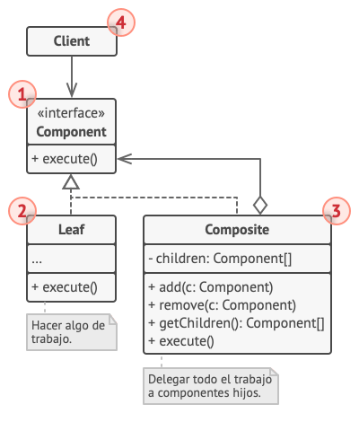

# Composite

> [!NOTE]
> Objeto compuesto, Object Tree

## Proposito

El uso del patrón Composite sólo tiene sentido cuando el modelo central de tu aplicación puede representarse en forma de árbol.

## Problema

Por ejemplo, imagina que tienes dos tipos de objetos: ``Productos`` y ``Cajas``. Una ``Caja`` puede contener varios Productos así como cierto número de ``Cajas`` más pequeñas. Estas ``Cajas`` pequeñas también pueden contener algunos ``Productos`` o incluso ``Cajas`` más pequeñas, y así sucesivamente.

Digamos que decides crear un sistema de pedidos que utiliza estas clases. Los pedidos pueden contener productos sencillos sin envolver, así como cajas llenas de productos... y otras cajas. ¿Cómo determinarás el precio total de ese pedido?

Puedes intentar la solución directa: desenvolver todas las cajas, repasar todos los productos y calcular el total. Esto sería viable en el mundo real; pero en un programa no es tan fácil como ejecutar un bucle. Tienes que conocer de antemano las clases de ``Productos`` y ``Cajas`` a iterar, el nivel de anidación de las cajas y otros detalles desagradables. Todo esto provoca que la solución directa sea demasiado complicada, o incluso imposible.

## Solucion

El patrón Composite sugiere que trabajes con ``Productos`` y ``Cajas`` a través de una interfaz común que declara un método para calcular el precio total.

¿Cómo funcionaría este método? Para un producto, sencillamente devuelve el precio del producto. Para una caja, recorre cada artículo que contiene la caja, pregunta su precio y devuelve un total por la caja. Si uno de esos artículos fuera una caja más pequeña, esa caja también comenzaría a repasar su contenido y así sucesivamente, hasta que se calcule el precio de todos los componentes internos. Una caja podría incluso añadir costos adicionales al precio final, como costos de empaquetado.

La gran ventaja de esta solución es que no tienes que preocuparte por las clases concretas de los objetos que componen el árbol. No tienes que saber si un objeto es un producto simple o una sofisticada caja. Puedes tratarlos a todos por igual a través de la interfaz común. Cuando invocas un método, los propios objetos pasan la solicitud a lo largo del árbol.

### Analogia

Los ejércitos de la mayoría de países se estructuran como jerarquías. Un ejército está formado por varias divisiones; una división es un grupo de brigadas y una brigada está formada por pelotones, que pueden dividirse en escuadrones. Por último, un escuadrón es un pequeño grupo de soldados reales. Las órdenes se dan en la parte superior de la jerarquía y se pasan hacia abajo por cada nivel hasta que todos los soldados saben lo que hay que hacer.

## Estructura

1. La interfaz **Componente** describe operaciones que son comunes a elementos simples y complejos del árbol

2. La **Hoja** es un elemento básico de un árbol que no tiene subelementos.

> [!NOTE]
> Normalmente, los componentes de la hoja acaban realizando la mayoría del trabajo real, ya que no tienen a nadie a quien delegarle el trabajo.

3. El **Contenedor** (también llamado compuesto) es un elemento que tiene subelementos: hojas u otros contenedores. Un contenedor no conoce las clases concretas de sus hijos. Funciona con todos los subelementos únicamente a través de la interfaz componente.

> [!NOTE]
> Al recibir una solicitud, un contenedor delega el trabajo a sus subelementos, procesa los resultados intermedios y devuelve el resultado final al cliente.

4. El **Cliente** funciona con todos los elementos a través de la interfaz componente. Como resultado, el cliente puede funcionar de la misma manera tanto con elementos simples como complejos del árbol.

## Implementacion

En este ejemplo, el patrón Composite te permite implementar el apilamiento (stacking) de formas geométricas en un editor gráfico.

## Aplicabilidad

- Utiliza el patrón Composite cuando tengas que implementar una estructura de objetos con forma de árbol.

- Utiliza el patrón cuando quieras que el código cliente trate elementos simples y complejos de la misma forma.

## Como Usarlo

1. Asegúrate de que el modelo central de tu aplicación pueda representarse como una estructura de árbol. Intenta dividirlo en elementos simples y contenedores. Recuerda que los contenedores deben ser capaces de contener tanto elementos simples como otros contenedores.

2. Declara la interfaz componente con una lista de métodos que tengan sentido para componentes simples y complejos.

3. Crea una clase hoja para representar elementos simples. Un programa puede tener varias clases hoja diferentes.

4. Crea una clase contenedora para representar elementos complejos. Incluye un campo matriz en esta clase para almacenar referencias a subelementos. La matriz debe poder almacenar hojas y contenedores, así que asegúrate de declararla con el tipo de la interfaz componente.

> [!NOTE]
> Al implementar los métodos de la interfaz componente, recuerda que un contenedor debe delegar la mayor parte del trabajo a los subelementos.

5. Por último, define los métodos para añadir y eliminar elementos hijos dentro del contenedor.

## Pros y contras

Pros  | Contras
------------- | -------------
Puedes trabajar con estructuras de árbol complejas con mayor comodidad: utiliza el polimorfismo y la recursión en tu favor.  |   Puede resultar difícil proporcionar una interfaz común para clases cuya funcionalidad difiere demasiado. En algunos casos, tendrás que generalizar en exceso la interfaz componente, provocando que sea más difícil de comprender.
Principio de abierto/cerrado. Puedes introducir nuevos tipos de elemento en la aplicación sin descomponer el código existente, que ahora funciona con el árbol de objetos.  |    
 
