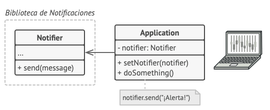
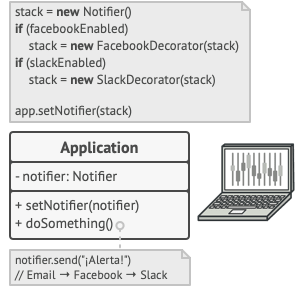
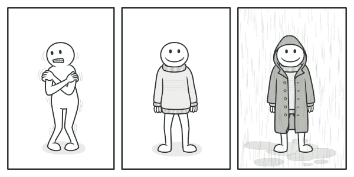

# Decorator

> [!NOTE]
> Decorador, Envoltorio, Wrapper

## Proposito

**Decorator** es un patrón de diseño estructural que te permite añadir funcionalidades a objetos colocando estos objetos dentro de objetos encapsuladores especiales que contienen estas funcionalidades.

## Problema

Imagina que estás trabajando en una biblioteca de notificaciones que permite a otros programas notificar a sus usuarios acerca de eventos importantes.

La versión inicial de la biblioteca se basaba en la clase ``Notificador`` que solo contaba con unos cuantos campos, un constructor y un único método ``send``. El método podía aceptar un argumento de mensaje de un cliente y enviar el mensaje a una lista de correos electrónicos que se pasaban a la clase notificadora a través de su constructor. Una aplicación de un tercero que actuaba como cliente debía crear y configurar el objeto notificador una vez y después utilizarlo cada vez que sucediera algo importante.

En cierto momento te das cuenta de que los usuarios de la biblioteca esperan algo más que unas simples notificaciones por correo. A muchos de ellos les gustaría recibir mensajes SMS sobre asuntos importantes. Otros querrían recibir las notificaciones por Facebook y, por supuesto, a los usuarios corporativos les encantaría recibir notificaciones por Slack.

No puede ser muy complicado ¿verdad? Extendiste la clase Notificador y metiste los métodos adicionales de notificación dentro de nuevas subclases. Ahora el cliente debería instanciar la clase notificadora deseada y utilizarla para el resto de notificaciones.

Pero entonces alguien te hace una pregunta razonable: “¿Por qué no se pueden utilizar varios tipos de notificación al mismo tiempo? Si tu casa está en llamas, probablemente quieras que te informen a través de todos los canales”.

Intentaste solucionar ese problema creando subclases especiales que combinaban varios métodos de notificación dentro de una clase. Sin embargo, enseguida resultó evidente que esta solución inflaría el código en gran medida, no sólo el de la biblioteca, sino también el código cliente.

Debes encontrar alguna otra forma de estructurar las clases de las notificaciones para no alcanzar cifras que rompan accidentalmente un récord Guinness.

## Solucion

Cuando tenemos que alterar la funcionalidad de un objeto, lo primero que se viene a la mente es extender una clase. No obstante, la herencia tiene varias limitaciones importantes de las que debes ser consciente.

- La herencia es estática. No se puede alterar la funcionalidad de un objeto existente durante el tiempo de ejecución. Sólo se puede sustituir el objeto completo por otro creado a partir de una subclase diferente.

- Las subclases sólo pueden tener una clase padre. En la mayoría de lenguajes, la herencia no permite a una clase heredar comportamientos de varias clases al mismo tiempo

Una de las formas de superar estas limitaciones es empleando la Agregación o la Composición  en lugar de la Herencia. Ambas alternativas funcionan prácticamente del mismo modo: un objeto tiene una referencia a otro y le delega parte del trabajo, mientras que con la herencia, el propio objeto puede realizar ese trabajo, heredando el comportamiento de su superclase.

> [!NOTE]
> La agregacion es cuando un objeto A contiene objetos B. Adicionalmente el B puede existir sin el A

Con esta nueva solución puedes sustituir fácilmente el objeto “ayudante” vinculado por otro, cambiando el comportamiento del contenedor durante el tiempo de ejecución. Un objeto puede utilizar el comportamiento de varias clases con referencias a varios objetos, delegándoles todo tipo de tareas. La agregación/composición es el principio clave que se esconde tras muchos patrones de diseño, incluyendo el Decorator. A propósito, regresemos a la discusión sobre el patrón.

“Wrapper” (envoltorio, en inglés) es el sobrenombre alternativo del patrón Decorator, que expresa claramente su idea principal. Un wrapper es un objeto que puede vincularse con un objeto objetivo. El wrapper contiene el mismo grupo de métodos que el objetivo y le delega todas las solicitudes que recibe. No obstante, el wrapper puede alterar el resultado haciendo algo antes o después de pasar la solicitud al objetivo.

¿Cuándo se convierte un simple wrapper en el verdadero decorador? Como he mencionado, el wrapper implementa la misma interfaz que el objeto envuelto. Éste es el motivo por el que, desde la perspectiva del cliente, estos objetos son idénticos. Haz que el campo de referencia del wrapper acepte cualquier objeto que siga esa interfaz. Esto te permitirá envolver un objeto en varios wrappers, añadiéndole el comportamiento combinado de todos ellos.

En nuestro ejemplo de las notificaciones, dejemos la sencilla funcionalidad de las notificaciones por correo electrónico dentro de la clase base ``Notificador``, pero convirtamos el resto de los métodos de notificación en decoradores.

El código cliente debe envolver un objeto notificador básico dentro de un grupo de decoradores que satisfagan las preferencias del cliente. Los objetos resultantes se estructurarán como una pila.

El último decorador de la pila será el objeto con el que el cliente trabaja. Debido a que todos los decoradores implementan la misma interfaz que la notificadora base, al resto del código cliente no le importa si está trabajando con el objeto notificador “puro” o con el decorado.

Podemos aplicar la misma solución a otras funcionalidades, como el formateo de mensajes o la composición de una lista de destinatarios. El cliente puede decorar el objeto con los decoradores personalizados que desee, siempre y cuando sigan la misma interfaz que los demás.

### Analogia

Vestir ropa es un ejemplo del uso de decoradores. Cuando tienes frío, te cubres con un suéter. Si sigues teniendo frío a pesar del suéter, puedes ponerte una chaqueta encima. Si está lloviendo, puedes ponerte un impermeable. Todas estas prendas “extienden” tu comportamiento básico pero no son parte de ti, y puedes quitarte fácilmente cualquier prenda cuando lo desees.

## Estructura

1. El **Componente** declara la interfaz común tanto para wrappers como para objetos envueltos.

2. **Componente Concreto** es una clase de objetos envueltos. Define el comportamiento básico, que los decoradores pueden alterar.

3. La clase **Decoradora Base** tiene un campo para referenciar un objeto envuelto. El tipo del campo debe declararse como la interfaz del componente para que pueda contener tanto los componentes concretos como los decoradores. La clase decoradora base delega todas las operaciones al objeto envuelto.

4. Los **Decoradores Concretos** definen funcionalidades adicionales que se pueden añadir dinámicamente a los componentes. Los decoradores concretos sobrescriben métodos de la clase decoradora base y ejecutan su comportamiento, ya sea antes o después de invocar al método padre.

5. El **Cliente** puede envolver componentes en varias capas de decoradores, siempre y cuando trabajen con todos los objetos a través de la interfaz del componente.

## Implementacion

En este ejemplo, el patrón Decorator te permite comprimir y encriptar información delicada independientemente del código que utiliza esos datos.

## Aplicabilidad

- Utiliza el patrón Decorator cuando necesites asignar funcionalidades adicionales a objetos durante el tiempo de ejecución sin descomponer el código que utiliza esos objetos.

- Utiliza el patrón cuando resulte extraño o no sea posible extender el comportamiento de un objeto utilizando la herencia.

## Como Usarlo

1. Asegúrate de que tu dominio de negocio puede representarse como un componente primario con varias capas opcionales encima

2. Decide qué métodos son comunes al componente primario y las capas opcionales. Crea una interfaz de componente y declara esos métodos en ella.

3. Crea una clase concreta de componente y define en ella el comportamiento base.

4. Crea una clase base decoradora. Debe tener un campo para almacenar una referencia a un objeto envuelto. El campo debe declararse con el tipo de interfaz de componente para permitir la vinculación a componentes concretos, así como a decoradores. La clase decoradora base debe delegar todas las operaciones al objeto envuelto.

5. Asegúrate de que todas las clases implementan la interfaz de componente.

6. Crea decoradores concretos extendiéndolos a partir de la decoradora base. Un decorador concreto debe ejecutar su comportamiento antes o después de la llamada al método padre (que siempre delega al objeto envuelto).

7. El código cliente debe ser responsable de crear decoradores y componerlos del modo que el cliente necesite.

## Pros y contras

Pros  | Contras
------------- | -------------
Puedes extender el comportamiento de un objeto sin crear una nueva subclase.  |    Resulta difícil eliminar un wrapper específico de la pila de wrappers.
Puedes añadir o eliminar responsabilidades de un objeto durante el tiempo de ejecución.  |   Es difícil implementar un decorador de tal forma que su comportamiento no dependa del orden en la pila de decoradores. 
Puedes combinar varios comportamientos envolviendo un objeto con varios decoradores.  |   El código de configuración inicial de las capas pueden tener un aspecto desagradable
Principio de responsabilidad única. Puedes dividir una clase monolítica que implementa muchas variantes posibles de comportamiento, en varias clases más pequeñas.  |  
