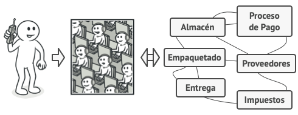

# Facade

> [!NOTE]
> Fachada

## Proposito

Facade es un patrón de diseño estructural que proporciona una interfaz simplificada a una biblioteca, un framework o cualquier otro grupo complejo de clases.

## Problema

Imagina que debes lograr que tu código trabaje con un amplio grupo de objetos que pertenecen a una sofisticada biblioteca o framework. Normalmente, debes inicializar todos esos objetos, llevar un registro de las dependencias, ejecutar los métodos en el orden correcto y así sucesivamente.

Como resultado, la lógica de negocio de tus clases se vería estrechamente acoplada a los detalles de implementación de las clases de terceros, haciéndola difícil de comprender y mantener.

## Solucion

Una fachada es una clase que proporciona una interfaz simple a un subsistema complejo que contiene muchas partes móviles. Una fachada puede proporcionar una funcionalidad limitada en comparación con trabajar directamente con el subsistema. Sin embargo, tan solo incluye las funciones realmente importantes para los clientes.

Tener una fachada resulta útil cuando tienes que integrar tu aplicación con una biblioteca sofisticada con decenas de funciones, de la cual sólo necesitas una pequeña parte.

Por ejemplo, una aplicación que sube breves vídeos divertidos de gatos a las redes sociales, podría potencialmente utilizar una biblioteca de conversión de vídeo profesional. Sin embargo, lo único que necesita en realidad es una clase con el método simple ``codificar(nombreDelArchivo, formato)``. Una vez que crees dicha clase y la conectes con la biblioteca de conversión de vídeo, tendrás tu primera fachada.

### Analogia

Cuando llamas a una tienda para hacer un pedido por teléfono, un operador es tu fachada a todos los servicios y departamentos de la tienda. El operador te proporciona una sencilla interfaz de voz al sistema de pedidos, pasarelas de pago y varios servicios de entrega.

## Estructura

1. El patrón **Facade** proporciona un práctico acceso a una parte específica de la funcionalidad del subsistema. Sabe a dónde dirigir la petición del cliente y cómo operar todas las partes móviles.

2. Puede crearse una clase **Fachada Adicional** para evitar contaminar una única fachada con funciones no relacionadas que podrían convertirla en otra estructura compleja. Las fachadas adicionales pueden utilizarse por clientes y por otras fachadas.

3. El **Subsistema Complejo** consiste en decenas de objetos diversos. Para lograr que todos hagan algo significativo, debes profundizar en los detalles de implementación del subsistema, que pueden incluir inicializar objetos en el orden correcto y suministrarles datos en el formato adecuado.

> [!NOTE]
> Las clases del subsistema no conocen la existencia de la fachada. Operan dentro del sistema y trabajan entre sí directamente.

4. El **Cliente** utiliza la fachada en lugar de invocar directamente los objetos del subsistema.

## Implementacion

En este ejemplo, el patrón Facade simplifica la interacción con un framework complejo de conversión de vídeo.

## Aplicabilidad

- Utiliza el patrón Facade cuando necesites una interfaz limitada pero directa a un subsistema complejo.

- Utiliza el patrón Facade cuando quieras estructurar un subsistema en capas.

## Como Usarlo

1. Comprueba si es posible proporcionar una interfaz más simple que la que está proporcionando un subsistema existente. Estás bien encaminado si esta interfaz hace que el código cliente sea independiente de muchas de las clases del subsistema.

2. Declara e implementa esta interfaz en una nueva clase fachada. La fachada deberá redireccionar las llamadas desde el código cliente a los objetos adecuados del subsistema. La fachada deberá ser responsable de inicializar el subsistema y gestionar su ciclo de vida, a no ser que el código cliente ya lo haga.

3. Para aprovechar el patrón al máximo, haz que todo el código cliente se comunique con el subsistema únicamente a través de la fachada. Ahora el código cliente está protegido de cualquier cambio en el código del subsistema. Por ejemplo, cuando se actualice un subsistema a una nueva versión, sólo tendrás que modificar el código de la fachada.

4. Si la fachada se vuelve demasiado grande, piensa en extraer parte de su comportamiento y colocarlo dentro de una nueva clase fachada refinada.

## Pros y contras

Pros  | Contras
------------- | -------------
Puedes aislar tu código de la complejidad de un subsistema.  |  Una fachada puede convertirse en un objeto todopoderoso acoplado a todas las clases de una aplicación.
