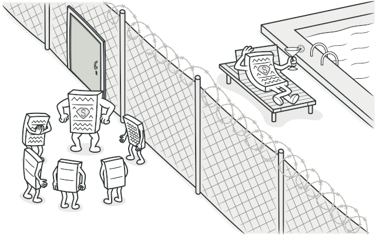
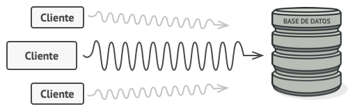
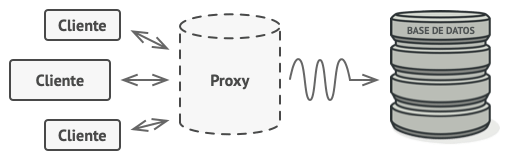
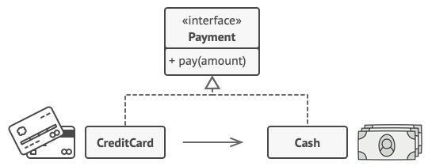
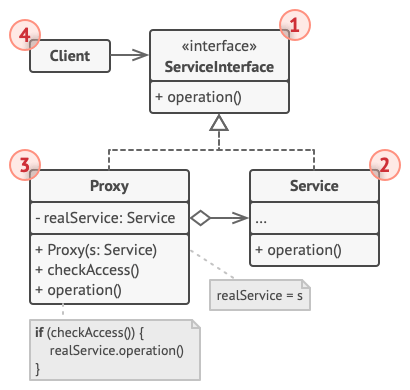
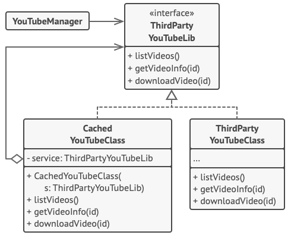

# Proxy

> [!NOTE]
> Proximidad

## Proposito

Proxy es un patrón de diseño estructural que te permite proporcionar un sustituto o marcador de posición para otro objeto. Un proxy controla el acceso al objeto original, permitiéndote hacer algo antes o después de que la solicitud llegue al objeto original.

## Problema

¿Por qué querrías controlar el acceso a un objeto? Imagina que tienes un objeto enorme que consume una gran cantidad de recursos del sistema. Lo necesitas de vez en cuando, pero no siempre.

Puedes llevar a cabo una implementación diferida, es decir, crear este objeto sólo cuando sea realmente necesario. Todos los clientes del objeto tendrán que ejecutar algún código de inicialización diferida. Lamentablemente, esto seguramente generará una gran cantidad de código duplicado.

En un mundo ideal, querríamos meter este código directamente dentro de la clase de nuestro objeto, pero eso no siempre es posible. Por ejemplo, la clase puede ser parte de una biblioteca cerrada de un tercero.

## Solucion

El patrón Proxy sugiere que crees una nueva clase proxy con la misma interfaz que un objeto de servicio original. Después actualizas tu aplicación para que pase el objeto proxy a todos los clientes del objeto original. Al recibir una solicitud de un cliente, el proxy crea un objeto de servicio real y le delega todo el trabajo.

Pero, ¿cuál es la ventaja? Si necesitas ejecutar algo antes o después de la lógica primaria de la clase, el proxy te permite hacerlo sin cambiar esa clase. Ya que el proxy implementa la misma interfaz que la clase original, puede pasarse a cualquier cliente que espere un objeto de servicio real.

### Analogia Real

Una tarjeta de crédito es un proxy de una cuenta bancaria, que, a su vez, es un proxy de un manojo de billetes. Ambos implementan la misma interfaz, por lo que pueden utilizarse para realizar un pago. El consumidor se siente genial porque no necesita llevar un montón de efectivo encima. El dueño de la tienda también está contento porque los ingresos de la transacción se añaden electrónicamente a la cuenta bancaria de la tienda sin el riesgo de perder el depósito o sufrir un robo de camino al banco.

## Estructura

1. La **Interfaz de Servicio** declara la interfaz del Servicio. El proxy debe seguir esta interfaz para poder camuflarse como objeto de servicio.

2. **Servicio** es una clase que proporciona una lógica de negocio útil.

3. La clase **Proxy** tiene un campo de referencia que apunta a un objeto de servicio. Cuando el proxy finaliza su procesamiento (por ejemplo, inicialización diferida, registro, control de acceso, almacenamiento en caché, etc.), pasa la solicitud al objeto de servicio.

4. El **Cliente** debe funcionar con servicios y proxies a través de la misma interfaz. De este modo puedes pasar un proxy a cualquier código que espere un objeto de servicio.

## Implementacion

Este ejemplo ilustra cómo el patrón Proxy puede ayudar a introducir la inicialización diferida y el almacenamiento en caché a una biblioteca de integración de YouTube de un tercero.

## Aplicabilidad

- Inicialización diferida (proxy virtual). Es cuando tienes un objeto de servicio muy pesado que utiliza muchos recursos del sistema al estar siempre funcionando, aunque solo lo necesites de vez en cuando.

- Control de acceso (proxy de protección). Es cuando quieres que únicamente clientes específicos sean capaces de utilizar el objeto de servicio, por ejemplo, cuando tus objetos son partes fundamentales de un sistema operativo y los clientes son varias aplicaciones lanzadas (incluyendo maliciosas).

- Ejecución local de un servicio remoto (proxy remoto). Es cuando el objeto de servicio se ubica en un servidor remoto.

- Solicitudes de registro (proxy de registro). Es cuando quieres mantener un historial de solicitudes al objeto de servicio.

- Resultados de solicitudes en caché (proxy de caché). Es cuando necesitas guardar en caché resultados de solicitudes de clientes y gestionar el ciclo de vida de ese caché, especialmente si los resultados son muchos.

- Referencia inteligente. Es cuando debes ser capaz de desechar un objeto pesado una vez que no haya clientes que lo utilicen.

## Como Usarlo

1. Si no hay una interfaz de servicio preexistente, crea una para que los objetos de proxy y de servicio sean intercambiables. No siempre resulta posible extraer la interfaz de la clase servicio, porque tienes que cambiar todos los clientes del servicio para utilizar esa interfaz. El plan B consiste en convertir el proxy en una subclase de la clase servicio, de forma que herede la interfaz del servicio.

2. Crea la clase proxy. Debe tener un campo para almacenar una referencia al servicio. Normalmente los proxies crean y gestionan el ciclo de vida completo de sus servicios. En raras ocasiones, el cliente pasa un servicio al proxy a través de un constructor.

3. Implementa los métodos del proxy según sus propósitos. En la mayoría de los casos, después de hacer cierta labor, el proxy debería delegar el trabajo a un objeto de servicio.

4. Considera introducir un método de creación que decida si el cliente obtiene un proxy o un servicio real. Puede tratarse de un simple método estático en la clase proxy o de todo un método de fábrica.

5. Considera implementar la inicialización diferida para el objeto de servicio.

## Pros y contras

Pros  | Contras
------------- | -------------
Puedes controlar el objeto de servicio sin que los clientes lo sepan.  |  El código puede complicarse ya que debes introducir gran cantidad de clases nuevas.
Puedes gestionar el ciclo de vida del objeto de servicio cuando a los clientes no les importa.  |  La respuesta del servicio puede retrasarse.
El proxy funciona incluso si el objeto de servicio no está listo o no está disponible.  |  
Principio de abierto/cerrado. Puedes introducir nuevos proxies sin cambiar el servicio o los clientes.  |  